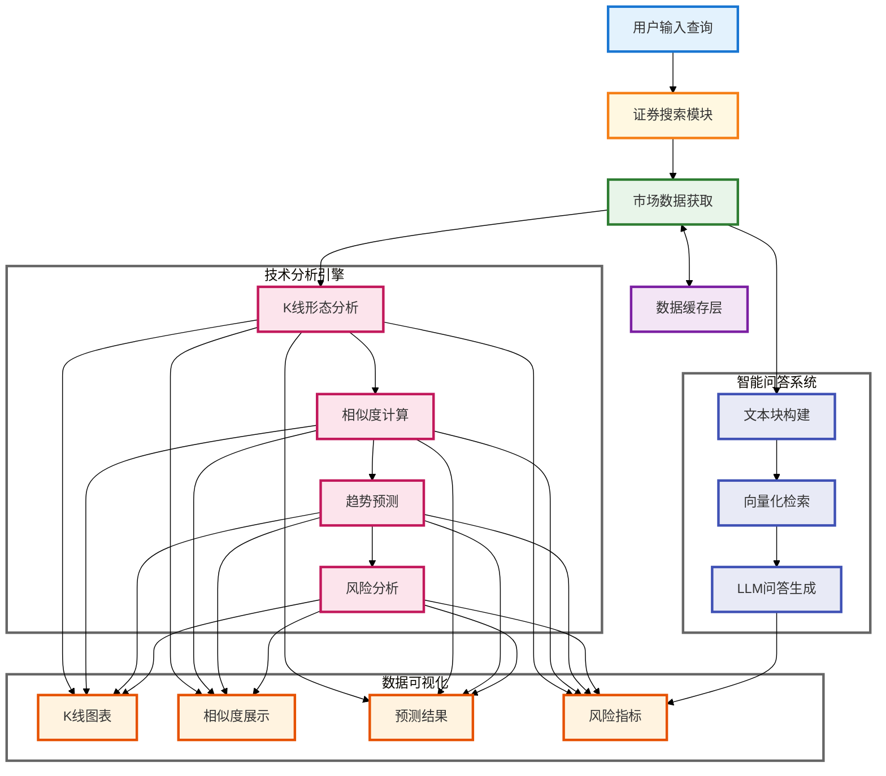

# 📈 A 股数据智能分析系统

## 📑 目录

1. [作者信息](#-作者信息)
2. [系统简介](#-系统简介)
3. [源码地址](#-源码地址)
4. [Demo 演示](#-demo)
5. [致谢](#-致谢)
6. [步骤演示](#-步骤演示)
7. [快速开始](#-快速开始)
   - [安装步骤](#-安装步骤)
   - [使用说明](#-使用说明)
   - [使用提示](#-使用提示)
8. [系统架构](#-系统架构)
9. [核心技术实现](#-核心技术实现)
   - [K 线形态识别与相似度匹配](#1-k-线形态识别与相似度匹配)
   - [智能问答系统](#2-智能问答系统)
   - [数据处理优化](#3-数据处理优化)
   - [性能优化与缓存机制](#4-性能优化与缓存机制)
10. [系统特点](#-系统特点)
11. [注意事项](#-注意事项)
12. [总结与展望](#-总结与展望)

---

## 👨‍💻 作者信息

姓名：吴小宇
学号：71265700016
课程：商业智能技术
老师：阮光册教授

## 🌟 系统简介

这是一个面向投资者的 A 股市场智能分析系统，旨在提供客观的市场分析和投资建议。💡 它的核心在于将传统的技术分析和现代人工智能相结合，为市场决策提供数据支持。

这个系统整合了技术分析 🔍 和智能问答 💬 功能，采用皮尔逊相关系数和欧氏距离等算法进行相似 K 线形态识别，结合基于统计概率的价格走势预测 📉，以及通过历史相似度匹配和风险度量（标准差/波动率）的持仓期分析 📊，并基于市场实时数据、RAG 检索增强生成和 GPT-4o-mini 的智能问答服务。

系统采用 TF-IDF 向量化、SVD 降维等机器学习算法和自然语言处理技术 🤖，致力于通过数据驱动的方式为投资决策提供参考。系统设计的目标是帮助投资者更全面地了解市场信息，理性权衡投资风险。⚖️

## 🔗 源码地址

[GitHub 仓库](https://github.com/mantoufan/yzhanSimilarKline)

## 🎥 Demo

在线使用：[阿里云节点（推荐，高速）](https://a.os120.com/)　[谷歌云节点（慢）](https://skline.streamlit.app/)  
视频演示：[点击播放](https://drfs.ctcontents.com/file/3312/1449237316/62baf7/yun/business-ai-demo.mp4)  
动画演示：  


## 🙏 致谢

特别感谢阮光册教授在商业智能技术课程中对相关技术和案例的讲解，受益匪浅。教授的指导帮助我更深入地理解了商业智能技术的实际应用，为本项目的开发提供了宝贵的理论依据和思路方向。👨‍🏫

## 📷 步骤演示

步骤 1：搜索 平安 / 上证指数 关键词，其它关键词没有缓存可能要等 5 分钟  


步骤 2：下拉查看历史相似 K 线图  


步骤 3：基于最相似的 10 条历史 K 线，预测未来 7 个交易日的涨跌情况  


步骤 4：如果当前交易日（非交易日最近），持有 1 - 7 交易日的收益率和胜率  


步骤 5：据用户输入问题，查询最相似的，将结构化数据语义化的不同类型的数据块，嵌入提示词  


步骤 6：根据内置 + 问题 + 嵌入数据块的提示词发给 GPT-4o-mini，返回结果


## 🚀 快速开始

### 💻 安装步骤

1. 克隆项目代码

```bash
git clone https://github.com/mantoufan/yzhanSimilarKline.git
cd yzhanSimilarKline
```

2. 创建并激活虚拟环境

```bash
python -m venv venv
# Windows
venv\Scripts\activate
# Linux/Mac
source venv/bin/activate
```

3. 安装依赖包

```bash
pip install -r requirements.txt
```

4. 配置环境变量
   在项目根目录创建`.env`文件，添加必要的配置：

```
API_KEY=your_api_key
API_BASE=https://api.openai.com
MODEL=gpt-4o-mini
PROXY_URL=your_proxy_url # 可选，用于获取公开金融数据
```

5. 启动应用

```bash
streamlit run streamlit_app.py
```

### 🕹️ 使用说明

1. **证券搜索**🔍：

   - 在搜索框输入股票代码或名称
   - 系统会显示匹配的证券列表，包括股票、指数和 ETF
   - 支持模糊搜索和智能匹配

2. **K 线分析**📈：

   - 点击感兴趣的证券查看详情
   - 查看 K 线图和相似形态分析
   - 研究趋势预测和风险分析结果

3. **智能问答**💬：

   - 在问答输入框输入您的问题
   - 系统会基于市场数据提供专业分析
   - 支持多轮对话和深度分析

4. **数据导出**📥：
   - 收益预测表可以导出 CSV
   - K 线图可以保存为 PNG 格式

### ⚠️ 使用提示

- 建议使用 Chrome 或 Firefox 浏览器获得最佳体验 👌
- 首次加载可能需要一些时间，请耐心等待缓存生成 ⏳
- 图表支持缩放、平移等交互操作 🖱️
- 智能问答支持多轮对话 💭

## 🏗️ 系统架构



## 📦 核心技术实现

### 1. K 线形态识别与相似度匹配

系统使用皮尔逊相关系数和欧氏距离的组合方法来识别相似 K 线形态。通过对价格序列进行标准化处理，使得不同时期、不同价位的 K 线可以进行比较：

```python
def normalize_window(window):
    """对价格序列进行标准化处理"""
    numeric_window = pd.to_numeric(window, errors='coerce')
    if numeric_window.isna().any():
        return None
    return (numeric_window - numeric_window.iloc[0]) / numeric_window.iloc[0] * 100

def calculate_similarity(window1, window2):
    """计算两个价格序列的相似度"""
    if len(window1) != len(window2):
        return 0

    norm1 = normalize_window(window1)
    norm2 = normalize_window(window2)

    if norm1 is None or norm2 is None:
        return 0

    try:
        # 计算相关系数（-1到1之间）
        corr, _ = pearsonr(norm1, norm2)
        # 计算欧氏距离并归一化
        dist = euclidean(norm1, norm2)
        normalized_dist = 1 / (1 + dist/len(window1))
        # 加权平均得到最终相似度
        similarity = (corr + 1)/2 * 0.7 + normalized_dist * 0.3
        return similarity
    except:
        return 0
```

核心技术特点：

- **时间序列处理**🕰️：使用 pandas 的 DatetimeIndex 处理 K 线数据
- **统计学方法**📊：
  - 皮尔逊相关系数：衡量价格序列的走势相关性
  - 欧氏距离：评估价格序列的形态差异
- **数据标准化**🎚️：基于首日价格的百分比变化

### 2. 智能问答系统

系统采用 RAG（检索增强生成）技术架构，结合向量化检索和大语言模型：

```python
def create_text_chunks(security, current_df, similar_patterns, holding_stats):
    """构建结构化文本块供检索"""
    chunks = []

    # 构建基本信息文本块
    basic_info = f"""
        证券基本信息：
        名称：{security['name']}
        代码：{security['code']}
        类型：{security['type']}
        交易所：{security['exchange']}
    """
    chunks.append(("basic_info", basic_info))

    if current_df is not None and not current_df.empty:
        # 添加最新行情信息
        latest_data = current_df.iloc[-1]
        latest_market = f"""
        最新市场行情（{latest_data['trade_date'].strftime('%Y-%m-%d')}）：
        收盘价：{latest_data['close']:.2f}
        开盘价：{latest_data['open']:.2f}
        最高价：{latest_data['high']:.2f}
        最低价：{latest_data['low']:.2f}
        成交量：{latest_data.get('volume', '未知')}
        """
        chunks.append(("latest_market", latest_market))

    return chunks

class ChineseTextVectorizer:
    """中文文本向量化处理器"""
    def __init__(self, vector_size=100):
        self.tfidf = TfidfVectorizer(
            tokenizer=self._parallel_tokenize,  # 使用并行分词处理器
            max_features=2000
        )
        self.svd = TruncatedSVD(
            n_components=vector_size,
            random_state=42
        )
        self.is_fitted = False
        jieba.initialize()

    @lru_cache(maxsize=1000)
    def _tokenize(self, text):
        """基础分词方法，带有缓存优化"""
        text = re.sub(r'[^\w\s]', '', text)
        words = jieba.lcut(text)
        return [w for w in words if w.strip()]

    def _parallel_tokenize(self, text):
        """
        并行分词处理器，针对长文本优化
        - 短文本（<1000字符）直接处理
        - 长文本使用多线程并行分词
        """
        if len(text) < 1000:
            return self._tokenize(text)

        chunks = self._split_text(text)
        with ThreadPoolExecutor(max_workers=4) as executor:
            results = list(executor.map(self._tokenize, chunks))
        return [token for chunk_result in results for token in chunk_result]
```

### 3. 数据处理优化

系统实现了文件缓存机制来提升性能：

```python
@file_cache(cache_dir="./securities_cache", expire_days=30)
def load_security_data(security_type: str) -> pd.DataFrame:
    """加载证券数据，支持本地文件缓存"""
    try:
        if security_type == 'index':
            return adata.stock.info.all_index_code()
        elif security_type == 'stock':
            return adata.stock.info.all_code()
        elif security_type == 'etf':
            return adata.fund.info.all_etf_exchange_traded_info()
        else:
            return pd.DataFrame()
    except Exception as e:
        print(f"加载{security_type}数据时出错: {str(e)}")
        return pd.DataFrame()

def search_securities(query: str) -> List[Dict]:
    """搜索证券(指数、股票)"""
    if not query or len(query.strip()) == 0:
        return []

    # 预处理查询关键词
    query = preprocess_query(query)

    # 使用线程池并行搜索不同类型的证券
    security_types = ['index', 'stock', 'etf']
    with ThreadPoolExecutor(max_workers=2) as executor:
        futures = [
            executor.submit(search_single_type, query, security_type)
            for security_type in security_types
        ]

        # 收集所有结果
        all_results = []
        for future in futures:
            try:
                results = future.result()
                all_results.extend(results)
            except Exception as e:
                print(f"获取搜索结果时出错: {str(e)}")

    # 按相关度排序结果
    all_results.sort(key=lambda x: (
        -int(x['code'].lower() == query),  # 完全匹配代码的优先级最高
        -int(query in x['code'].lower()),  # 其次是包含代码的
        -int(query in x['name'].lower()),  # 再次是包含名称的
        len(x['code'])  # 最后按代码长度排序
    ))

    return all_results
```

### 4. 性能优化与缓存机制

系统通过文件缓存机制来提升数据加载性能：

```python
def file_cache(cache_dir="./data_cache", expire_days=1):
    """文件缓存装饰器，将数据存储到本地文件系统"""
    def decorator(func):
        def wrapper(*args, **kwargs):
            # 创建缓存目录
            os.makedirs(cache_dir, exist_ok=True)

            # 构建缓存文件路径
            cache_key = f"{func.__name__}_{str(args)}_{str(kwargs)}"
            cache_file = os.path.join(cache_dir, f"{cache_key}.json")
            meta_file = os.path.join(cache_dir, f"{cache_key}_meta.json")

            # 检查缓存是否存在且未过期
            if os.path.exists(cache_file) and os.path.exists(meta_file):
                with open(meta_file, 'r') as f:
                    meta = json.load(f)
                cache_time = datetime.strptime(meta['timestamp'],
                                             '%Y-%m-%d %H:%M:%S')

                if datetime.now() - cache_time < timedelta(days=expire_days):
                    with open(cache_file, 'r') as f:
                        return json.load(f)

            # 获取新数据并缓存
            results = func(*args, **kwargs)

            try:
                with open(cache_file, 'w') as f:
                    json.dump(results, f, ensure_ascii=False, indent=2)

                meta = {
                    'timestamp': datetime.now().strftime('%Y-%m-%d %H:%M:%S'),
                    'function': func.__name__,
                    'args': str(args),
                    'kwargs': str(kwargs)
                }
                with open(meta_file, 'w') as f:
                    json.dump(meta, f, ensure_ascii=False, indent=2)

            except Exception as e:
                print(f"写入缓存文件出错: {str(e)}")

            return results
        return wrapper
    return decorator
```

## ⭐ 系统特点

1. **高效数据处理**🚀：

   - 文件缓存机制，提高数据加载速度 💾
   - 使用线程池并行搜索不同类型证券 🧵
   - LRU 缓存优化分词结果 ⏳
   - 长文本的并行分词处理 ⚡

2. **精准分析引擎**🧠：

   - 基于皮尔逊相关系数和欧氏距离的 K 线相似度计算 🧮
   - TF-IDF 和 SVD 的文本向量化处理 🎯
   - 基于统计的风险收益分析 📉

3. **用户友好界面**👨‍💻：
   - 清晰的数据可视化 📊
   - 简洁的搜索功能 🔍
   - 智能的问答系统 💬

## ⚠️ 注意事项

1. 所有分析结果仅供参考，不构成投资建议 ❌
2. 过往表现不代表未来收益 📉
3. 投资有风险，入市需谨慎 ⚠️

## 🎉 总结与展望

在 A 股智能分析系统的开发过程中，本项目主要取得了以下成果：

1. 实现了基于皮尔逊相关系数和欧氏距离的 K 线形态识别
2. 构建了文件缓存系统提升数据加载性能
3. 开发了基于 TF-IDF 和 SVD 的智能问答系统
4. 集成了市场数据分析和风险评估功能

同时也发现了一些可以改进的方向：

1. 🐌 接口速度：目前采用的免费公用接口在线上运行时速度较慢，可以考虑升级到更快的数据服务。

2. 🌐 Web 框架选择：Streamlit 虽然开发便捷，但在性能上存在一定限制，未来可以评估其他更高性能的框架。

3. 📊 K 线分析深度：可以考虑引入更多技术指标，提供更全面的市场分析。

4. 💡 AI 模型优化：可以探索更先进的自然语言处理模型，提升智能问答的质量。

总的来说，这个项目实现了技术分析与人工智能的基础结合，为投资决策提供了数据支持。未来将继续优化系统性能，完善分析功能，为投资者提供更专业的市场分析工具。
