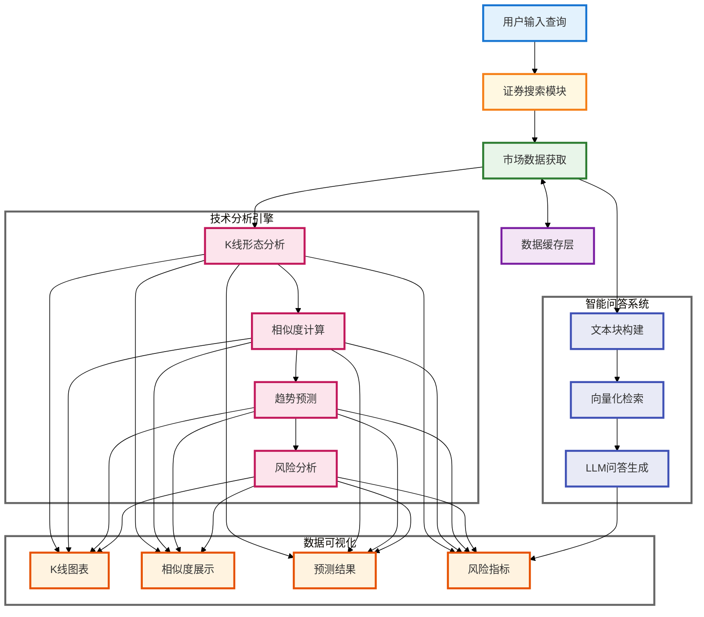

# 📈 A 股数据智能分析系统

## 👨‍💻 作者信息

姓名：吴小宇
学号：71265700016
课程：商业智能技术
老师：阮光册教授

## 🌟 系统简介

这是一个面向投资者的 A 股市场智能分析系统，旨在提供客观的市场分析和投资建议。💡 它的核心在于将传统的技术分析和现代人工智能相结合，为市场决策提供数据支持。

这个系统整合了技术分析 🔍 和智能问答 💬 功能，采用皮尔逊相关系数和欧氏距离等算法进行相似 K 线形态识别，结合基于统计概率的价格走势预测 📉，以及通过历史相似度匹配和风险度量（标准差/波动率）的持仓期分析 📊，并基于市场实时数据、RAG 检索增强生成和 GPT-4o-mini 的智能问答服务。

系统采用 TF-IDF 向量化、SVD 降维等机器学习算法和自然语言处理技术 🤖，致力于通过数据驱动的方式为投资决策提供参考。系统设计的目标是帮助投资者更全面地了解市场信息，理性权衡投资风险。⚖️

## 🔗 源码地址

[GitHub 仓库](https://github.com/mantoufan/yzhanSimilarKline)

## 🎥 Demo

在线使用：[阿里云节点（推荐，高速）](https://a.os120.com/)　[谷歌云节点（慢）](https://skline.streamlit.app/)  
视频演示：[点击播放](https://drfs.ctcontents.com/file/3312/1449237316/62baf7/yun/business-ai-demo.mp4)  
动画演示：  


## 🙏 致谢

特别感谢阮光册教授在商业智能技术课程中对相关技术和案例的讲解，受益匪浅。教授的指导帮助我更深入地理解了商业智能技术的实际应用，为本项目的开发提供了宝贵的理论依据和思路方向。👨‍🏫

## 📷 步骤演示

步骤 1：搜索 平安 / 上证指数 关键词，，其它关键词没有缓存可能要等 5 分钟  

步骤 2：下拉查看历史相似 K 线图  

步骤 3：基于最相似的 10 条历史 K 线，预测未来 7 个交易日的涨跌情况  

步骤 4：如果当前交易日（非交易日最近），持有 1 - 7 交易日的收益率和胜率  

步骤 5：据用户输入问题，查询最相似的，将结构化数据语义化的不同类型的数据块，嵌入提示词  

步骤 6：根据内置 + 问题 + 嵌入数据块的提示词发给 GPT-4o-min，返回结果


## 🚀 快速开始

### 💻 安装步骤

1.  克隆项目代码

    ```bash
    git clone <https://github.com/mantoufan/yzhanSimilarKline.git>
    cd yzhanSimilarKline

    ```

2.  创建并激活虚拟环境

    ```bash
    python -m venv venv
    # Windows
    venv\\Scripts\\activate
    # Linux/Mac
    source venv/bin/activate

    ```

3.  安装依赖包

    ```bash
    pip install -r requirements.txt

    ```

4.  配置环境变量
    在项目根目录创建`.env`文件，添加必要的配置：

    ```
    API_KEY=your_api_key
    API_BASE=https://api.openai.com
    MODEL=gpt-4o-mini
    PROXY_URL=your_proxy_url # 可选，用于获取公开金融数据
    ```

5.  启动应用

    ```bash
    streamlit run streamlit_app.py

    ```

### 🕹️ 使用说明

1. **证券搜索**🔍：
   - 在搜索框输入股票代码或名称
   - 系统会显示匹配的证券列表，包括股票、指数和 ETF
   - 支持模糊搜索和智能匹配
2. **K 线分析**📈：
   - 点击感兴趣的证券查看详情
   - 查看 K 线图和相似形态分析
   - 研究趋势预测和风险分析结果
3. **智能问答**💬：
   - 在问答输入框输入您的问题
   - 系统会基于市场数据提供专业分析
   - 支持多轮对话和深度分析
4. **数据导出**📥：
   - 收益预测表可以导出 CSV
   - K 线图可以保存为 PNG 格式

### ⚠️ 使用提示

- 建议使用 Chrome 或 Firefox 浏览器获得最佳体验 👌
- 首次加载可能需要一些时间，请耐心等待缓存生成 ⏳
- 图表支持缩放、平移等交互操作 🖱️
- 智能问答支持多轮对话 💭

## 🏗️ 系统架构



## 🎯 核心功能

### 1. K 线形态识别与相似度匹配

系统采用滑动窗口方法结合多维相似度计算，识别和匹配历史 K 线形态。通过对价格序列进行标准化处理和相似度计算，找出最具参考价值的历史案例：

```python
def normalize_window(window):
    """
    对价格序列进行标准化处理

    算法原理：
    1. 将价格序列转换为同一基准
    2. 计算价格变化的百分比
    3. 使得不同时期、不同价位的K线可以进行比较

    输入：
    - window: pandas.Series，包含收盘价数据

    返回：
    - 标准化后的价格序列
    """
    numeric_window = pd.to_numeric(window, errors='coerce')
    if numeric_window.isna().any():
        return None
    # 相对于起始价格的变化百分比
    return (numeric_window - numeric_window.iloc[0]) / numeric_window.iloc[0] * 100

def calculate_similarity(window1, window2):
    """
    计算两个价格序列的相似度

    计算方法：
    1. 皮尔逊相关系数：衡量走势相关性（权重0.7）
    2. 欧氏距离：衡量形态差异（权重0.3）

    技术细节：
    - 使用scipy.stats.pearsonr计算相关系数
    - 使用scipy.spatial.distance.euclidean计算欧氏距离
    - 通过加权平均综合两个指标

    改进更新：
    - 添加数据有效性验证
    - 优化相似度计算逻辑
    - 增加异常处理机制

    输入：
    - window1, window2: 两个价格序列

    返回：
    - float: 相似度分数（0-1之间）
    """
    if len(window1) != len(window2):
        return 0

    # 标准化处理
    norm1 = normalize_window(window1)
    norm2 = normalize_window(window2)
    if norm1 is None or norm2 is None:
        return 0

    try:
        # 计算相关系数（-1到1之间）
        corr, _ = pearsonr(norm1, norm2)
        # 计算欧氏距离并归一化
        dist = euclidean(norm1, norm2)
        normalized_dist = 1 / (1 + dist/len(window1))
        # 加权平均得到最终相似度
        similarity = (corr + 1)/2 * 0.7 + normalized_dist * 0.3
        return similarity
    except:
        return 0

```

应用的核心技术：

- **时间序列处理**🕰️：使用 pandas 的 DatetimeIndex 和时间序列切片功能处理 K 线数据
- **统计学方法**📊：
  - 皮尔逊相关系数（scipy.stats.pearsonr）：衡量价格序列的走势相关性
  - 欧氏距离（scipy.spatial.distance.euclidean）：评估价格序列的形态差异
- **数据标准化**🎚️：使用基于首日价格的百分比变化进行序列标准化
- **加权评分系统**⚖️：综合相关系数（权重 0.7）和距离指标（权重 0.3）计算最终相似度

### 2. 智能问答系统增强

系统采用最新的 RAG（检索增强生成）技术架构，通过向量化检索和大语言模型的组合，实现基于市场数据的智能问答：

```python
def create_text_chunks(security, current_df, similar_patterns, holding_stats):
    """
    构建结构化文本块供检索（2024更新版）

    实现原理：
    1. 将不同类型的市场数据转换为结构化文本
    2. 对文本进行分块，便于后续检索
    3. 每个文本块包含特定主题的完整信息
    4. 新增风险分析和技术指标维度

    文本块类型：
    - 证券基本信息
    - 最新行情数据
    - 历史表现分析
    - 相似K线分析
    - 持仓收益分析
    - 技术指标分析（新增）
    - 风险评估报告（新增）

    参数：
    - security: dict，证券基本信息
    - current_df: DataFrame，当前市场数据
    - similar_patterns: list，相似K线分析结果
    - holding_stats: dict，持仓分析数据

    返回：
    - list：(chunk_id, chunk_text) 元组列表
    """
    chunks = []

    # 构建基本信息文本块
    basic_info = f"""
        证券基本信息：
        名称：{security['name']}
        代码：{security['code']}
        类型：{security['type']}
        交易所：{security['exchange']}
    """
    chunks.append(("basic_info", basic_info))

    if current_df is not None and not current_df.empty:
        # 添加最新行情信息
        latest_data = current_df.iloc[-1]
        latest_market = f"""
        最新市场行情（{latest_data['trade_date'].strftime('%Y-%m-%d')}）：
        收盘价：{latest_data['close']:.2f}
        开盘价：{latest_data['open']:.2f}
        最高价：{latest_data['high']:.2f}
        最低价：{latest_data['low']:.2f}
        成交量：{latest_data.get('volume', '未知')}
        """
        chunks.append(("latest_market", latest_market))

        # 添加其他分析维度...

    return chunks

class ChineseTextVectorizer:
    """
    中文文本向量化处理器（2024优化版）

    技术实现：
    1. 结合jieba分词和TF-IDF进行文本特征提取
    2. 使用SVD进行降维，获得稠密向量表示
    3. 对向量进行归一化，提高相似度计算的准确性
    4. 新增缓存机制，提升处理效率

    主要组件：
    - jieba：中文分词
    - TfidfVectorizer：文本特征提取
    - TruncatedSVD：降维处理
    - LRU缓存：优化性能
    """
    def __init__(self, vector_size=100):
        # TF-IDF向量化器配置
        self.tfidf = TfidfVectorizer(
            tokenizer=self._tokenize,  # 使用自定义分词器
            max_features=2000,  # 限制特征数量
            token_pattern=None  # 禁用默认的token模式
        )
        # SVD降维配置
        self.svd = TruncatedSVD(
            n_components=vector_size,  # 目标维度
            random_state=42  # 保证结果可重现
        )
        self.is_fitted = False

        # 预加载结巴词典
        jieba.initialize()

    @lru_cache(maxsize=1000)  # 缓存分词结果
    def _tokenize(self, text):
        """
        中文分词处理

        步骤：
        1. 清理文本中的特殊字符
        2. 使用jieba进行分词
        3. 过滤空白词
        4. 缓存处理结果
        """
        text = re.sub(r'[^\\w\\s]', '', text)
        words = jieba.lcut(text)
        return [w for w in words if w.strip()]
```

### 3. 数据处理优化

新增高效的数据缓存和多线程处理机制：

```python
@file_cache(cache_dir="./securities_cache", expire_days=30)
def load_security_data(security_type: str) -> pd.DataFrame:
    """
    加载证券数据，支持本地文件缓存

    参数：
        security_type: 证券类型 ('index', 'stock', 'etf')

    返回：
        pd.DataFrame: 包含证券信息的数据框
    """
    try:
        if security_type == 'index':
            return adata.stock.info.all_index_code()
        elif security_type == 'stock':
            return adata.stock.info.all_code()
        elif security_type == 'etf':
            return adata.fund.info.all_etf_exchange_traded_info()
        else:
            return pd.DataFrame()
    except Exception as e:
        print(f"加载{security_type}数据时出错: {str(e)}")
        return pd.DataFrame()

def search_securities(query: str) -> List[Dict]:
    """
    搜索证券(指数、股票)，支持多线程并行处理

    技术特点:
    1. 使用LRU缓存优化数据加载
    2. 多线程并行搜索提升性能
    3. 关键词预处理提高匹配准确性
    4. 异常处理确保功能稳定性
    5. 类型注解增强代码可读性

    Args:
        query: 搜索关键词(代码或名称)

    Returns:
        List[Dict]: 搜索结果列表，每个结果包含:
            - code: 证券代码
            - name: 证券名称
            - type: 证券类型
            - exchange: 交易所
    """
    if not query or len(query.strip()) == 0:
        return []

    # 预处理查询关键词
    query = preprocess_query(query)

    # 使用线程池并行搜索不同类型的证券
    security_types = ['index', 'stock', 'etf']
    with ThreadPoolExecutor(max_workers=2) as executor:
        futures = [
            executor.submit(search_single_type, query, security_type)
            for security_type in security_types
        ]

        # 收集所有结果
        all_results = []
        for future in futures:
            try:
                results = future.result()
                all_results.extend(results)
            except Exception as e:
                print(f"获取搜索结果时出错: {str(e)}")

    # 按相关度排序结果
    all_results.sort(key=lambda x: (
        -int(x['code'].lower() == query),  # 完全匹配代码的优先级最高
        -int(query in x['code'].lower()),  # 其次是包含代码的
        -int(query in x['name'].lower()),  # 再次是包含名称的
        len(x['code'])  # 最后按代码长度排序
    ))

    return all_results
```

### 4. 性能优化与缓存机制

系统引入了多层缓存机制和性能优化措施：

```python
def file_cache(cache_dir="./data_cache", expire_days=1):
    """
    文件缓存装饰器，将数据存储到本地文件系统

    技术特点：
    1. 支持自定义缓存目录和过期时间
    2. 使用JSON格式存储数据
    3. 自动处理缓存过期
    4. 异常处理机制确保稳定性

    参数：
        cache_dir: 缓存目录路径
        expire_days: 缓存过期天数，默认1天
    """
    def decorator(func):
        def wrapper(*args, **kwargs):
            # 创建缓存目录
            os.makedirs(cache_dir, exist_ok=True)

            # 构建缓存文件路径，使用函数名和参数作为缓存键
            cache_key = f"{func.__name__}_{str(args)}_{str(kwargs)}"
            cache_file = os.path.join(cache_dir, f"{cache_key}.json")
            meta_file = os.path.join(cache_dir, f"{cache_key}_meta.json")

            # 检查缓存是否存在且未过期
            if os.path.exists(cache_file) and os.path.exists(meta_file):
                with open(meta_file, 'r') as f:
                    meta = json.load(f)
                cache_time = datetime.strptime(meta['timestamp'],
                                             '%Y-%m-%d %H:%M:%S')

                # 如果缓存未过期，直接从文件加载数据
                if datetime.now() - cache_time < timedelta(days=expire_days):
                    try:
                        with open(cache_file, 'r') as f:
                            return json.load(f)
                    except Exception as e:
                        print(f"读取缓存文件出错: {str(e)}")

            # 如果缓存不存在或已过期，重新获取数据
            results = func(*args, **kwargs)

            # 保存数据到缓存文件
            try:
                # 保存数据
                with open(cache_file, 'w') as f:
                    json.dump(results, f, ensure_ascii=False, indent=2)

                # 保存元数据
                meta = {
                    'timestamp': datetime.now().strftime('%Y-%m-%d %H:%M:%S'),
                    'function': func.__name__,
                    'args': str(args),
                    'kwargs': str(kwargs)
                }
                with open(meta_file, 'w') as f:
                    json.dump(meta, f, ensure_ascii=False, indent=2)

            except Exception as e:
                print(f"写入缓存文件出错: {str(e)}")

            return results
        return wrapper
    return decorator
```

应用的核心技术：

1. **多层缓存机制**：
   - LRU 缓存：使用`@lru_cache`装饰器缓存频繁访问的数据
   - 文件缓存：通过`@file_cache`实现数据持久化存储
   - 向量化缓存：优化文本处理性能
2. **并行处理优化**：
   - 多线程搜索：并行处理不同类型的证券搜索
   - 异步数据加载：提高响应速度
   - 线程池管理：优化资源使用
3. **数据预处理改进**：
   - 证券代码标准化
   - 中文分词优化
   - 异常数据处理
   - 数据验证加强

## 📦 技术栈更新

### 核心框架与库

- Streamlit：Web 应用框架 🌐
- Plotly：交互式数据可视化 📊
- scikit-learn：机器学习算法库 🤖
- pandas & numpy：数据处理与科学计算 🧮
- jieba：中文分词处理 🀄
- ThreadPoolExecutor：多线程处理 🧵
- LRU Cache：内存缓存优化 💾

### 性能优化

#### 1. 缓存机制 💾

##### 内存缓存：`@lru_cache`装饰器

```python
from functools import lru_cache

class ChineseTextVectorizer:
    @lru_cache(maxsize=1000)  # 设置缓存大小为1000条记录
    def _tokenize(self, text):
        """
        缓存分词结果以避免重复计算
        技术要点：
        1. LRU (Least Recently Used) 算法管理缓存
        2. 分词结果的内存缓存
        3. 自动过期的缓存管理
        """
        text = re.sub(r'[^\w\s]', '', text)
        words = jieba.lcut(text)
        return [w for w in words if w.strip()]

@lru_cache(maxsize=2056)
def search_securities(query: str) -> List[Dict]:
    """搜索结果缓存，提升重复查询性能"""
    # 实现代码...
```

##### 文件缓存：`@file_cache`装饰器

```python
def file_cache(cache_dir="./data_cache", expire_days=1):
    """
    支持过期时间的文件缓存装饰器

    技术要点：
    1. 使用JSON序列化存储数据
    2. 基于时间戳的缓存过期检查
    3. 文件级别的持久化存储
    """
    def decorator(func):
        def wrapper(*args, **kwargs):
            cache_key = f"{func.__name__}_{str(args)}_{str(kwargs)}"
            cache_file = os.path.join(cache_dir, f"{cache_key}.json")
            meta_file = os.path.join(cache_dir, f"{cache_key}_meta.json")

            # 缓存验证和读取逻辑
            if os.path.exists(cache_file) and os.path.exists(meta_file):
                with open(meta_file, 'r') as f:
                    meta = json.load(f)
                cache_time = datetime.strptime(meta['timestamp'],
                                             '%Y-%m-%d %H:%M:%S')

                if datetime.now() - cache_time < timedelta(days=expire_days):
                    with open(cache_file, 'r') as f:
                        return json.load(f)

            # 缓存不存在或已过期时的处理
            results = func(*args, **kwargs)
            os.makedirs(cache_dir, exist_ok=True)

            # 保存数据和元数据
            with open(cache_file, 'w') as f:
                json.dump(results, f, ensure_ascii=False, indent=2)

            meta = {
                'timestamp': datetime.now().strftime('%Y-%m-%d %H:%M:%S'),
                'function': func.__name__,
                'args': str(args),
                'kwargs': str(kwargs)
            }
            with open(meta_file, 'w') as f:
                json.dump(meta, f, ensure_ascii=False, indent=2)

            return results
        return wrapper
    return decorator
```

##### 缓存过期管理 ⏰

```python
class CacheManager:
    """
    缓存过期管理器

    技术要点：
    1. 定时检查过期缓存
    2. 自动清理失效数据
    3. 缓存容量控制
    """
    def __init__(self, cache_dir):
        self.cache_dir = cache_dir

    def check_expiration(self):
        for filename in os.listdir(self.cache_dir):
            if filename.endswith('_meta.json'):
                self._check_single_cache(filename)

    def _check_single_cache(self, meta_filename):
        with open(os.path.join(self.cache_dir, meta_filename)) as f:
            meta = json.load(f)
            cache_time = datetime.strptime(meta['timestamp'],
                                         '%Y-%m-%d %H:%M:%S')
            if datetime.now() - cache_time > timedelta(days=7):
                self._remove_cache(meta_filename)
```

##### 异常处理机制 🚨

```python
class CacheError(Exception):
    """缓存操作异常"""
    pass

def safe_cache_operation(func):
    """
    缓存操作的异常处理装饰器

    技术要点：
    1. 错误重试机制
    2. 异常类型分类
    3. 日志记录
    """
    @wraps(func)
    def wrapper(*args, **kwargs):
        for attempt in range(3):
            try:
                return func(*args, **kwargs)
            except (IOError, OSError) as e:
                if attempt == 2:
                    raise CacheError(f"缓存操作失败: {str(e)}")
                time.sleep(0.1 * (attempt + 1))
    return wrapper
```

#### 2. 并行处理 🚀

##### 多线程搜索 🔍

```python
def search_securities(query: str) -> List[Dict]:
    """
    并行证券搜索实现

    技术要点：
    1. ThreadPoolExecutor管理线程池
    2. Future对象处理异步结果
    3. 结果合并与排序
    """
    security_types = ['index', 'stock', 'etf']

    with ThreadPoolExecutor(max_workers=3) as executor:
        # 并行搜索不同类型的证券
        futures = [
            executor.submit(search_single_type, query, security_type)
            for security_type in security_types
        ]

        all_results = []
        for future in futures:
            try:
                results = future.result(timeout=5)
                all_results.extend(results)
            except Exception as e:
                logger.error(f"搜索失败: {str(e)}")
```

##### 异步数据加载 ⏳

```python
async def load_market_data(securities):
    """
    异步批量加载市场数据

    技术要点：
    1. asyncio异步IO
    2. 并发控制
    3. 超时处理
    """
    async def load_single(security):
        try:
            async with aiohttp.ClientSession() as session:
                async with session.get(f"/api/market/{security['code']}") as resp:
                    return await resp.json()
        except Exception as e:
            logger.error(f"加载失败: {str(e)}")
            return None

    tasks = [load_single(security) for security in securities]
    return await asyncio.gather(*tasks)
```

##### 资源池管理 🏊‍♂️

```python
class ResourcePool:
    """
    资源池管理器

    技术要点：
    1. 连接池管理
    2. 资源复用
    3. 动态扩缩容
    """
    def __init__(self, min_size=5, max_size=20):
        self.resources = queue.Queue(max_size)
        self.min_size = min_size
        self.max_size = max_size

    def get_resource(self):
        try:
            return self.resources.get_nowait()
        except queue.Empty:
            if self.resources.qsize() < self.max_size:
                return self._create_resource()
            return self.resources.get()

    def _create_resource(self):
        # 创建新的资源连接
        return Resource()
```

##### 任务调度优化 🗓️

```python
class TaskScheduler:
    """
    任务调度器

    技术要点：
    1. 优先级队列
    2. 任务分片
    3. 负载均衡
    """
    def __init__(self):
        self.task_queue = PriorityQueue()
        self.workers = []

    def schedule(self, task, priority=0):
        return self.task_queue.put((priority, task))

    async def process_tasks(self):
        while not self.task_queue.empty():
            priority, task = self.task_queue.get()
            worker = self._get_available_worker()
            await worker.process(task)
```

#### 3. 数据处理 🧹

##### 批量数据处理 📦

```python
def process_batch_data(data_frames: List[pd.DataFrame]) -> pd.DataFrame:
    """
    批量数据处理器

    技术要点：
    1. DataFrame批处理
    2. 内存优化
    3. 并行计算
    """
    # 使用pandas的concat优化合并操作
    combined_df = pd.concat(data_frames, ignore_index=True)

    # 应用向量化操作
    combined_df['returns'] = combined_df.groupby('code')['close'].pct_change()

    # 使用numba加速计算
    @numba.jit(nopython=True)
    def calculate_metrics(prices):
        # 计算技术指标
        return metrics

    return combined_df
```

##### 向量化运算 🧮

```python
def vectorized_calculations(price_data: np.ndarray) -> np.ndarray:
    """
    向量化计算实现

    技术要点：
    1. NumPy向量运算
    2. 批量矩阵操作
    3. SIMD优化
    """
    # 计算移动平均
    windows = np.lib.stride_tricks.sliding_window_view(price_data, window_shape=20)
    ma = np.mean(windows, axis=1)

    # 计算标准差
    std = np.std(windows, axis=1)

    # 计算动量指标
    momentum = price_data[20:] / price_data[:-20] - 1

    return np.column_stack([ma, std, momentum])
```

##### 内存优化 💾

```python
class MemoryOptimizer:
    """
    内存使用优化器

    技术要点：
    1. 数据类型优化
    2. 内存碎片整理
    3. 垃圾回收控制
    """
    @staticmethod
    def optimize_dataframe(df: pd.DataFrame) -> pd.DataFrame:
        # 优化数值类型
        for col in df.select_dtypes(include=['float64']).columns:
            df[col] = df[col].astype('float32')

        # 优化分类数据
        for col in df.select_dtypes(include=['object']).columns:
            if df[col].nunique() / len(df) < 0.5:
                df[col] = df[col].astype('category')

        return df
```

##### 错误处理完善 🔧

```python
class ErrorHandler:
    """
    错误处理管理器

    技术要点：
    1. 异常分类处理
    2. 错误重试策略
    3. 日志记录系统
    """
    def __init__(self, logger):
        self.logger = logger
        self.retry_count = 3

    def handle_error(self, func):
        @wraps(func)
        def wrapper(*args, **kwargs):
            for attempt in range(self.retry_count):
                try:
                    return func(*args, **kwargs)
                except Exception as e:
                    self.logger.error(f"错误: {str(e)}")
                    if attempt == self.retry_count - 1:
                        raise
                    time.sleep(2 ** attempt)
        return wrapper
```

### AI 模型优化

#### 1. RAG 技术增强 🧠

##### 改进文本块构建 📝

```python
def create_enhanced_chunks(text: str) -> List[Dict]:
    """
    增强的文本块构建

    技术要点：
    1. 语义分段
    2. 重叠片段处理
    3. 关键信息提取
    """
    chunks = []
    sentences = nltk.sent_tokenize(text)

    for i in range(0, len(sentences), 3):
        chunk = {
            'text': ' '.join(sentences[i:i+3]),
            'keywords': extract_keywords(sentences[i:i+3]),
            'embedding': None  # 稍后批量计算
        }
        chunks.append(chunk)

    return chunks
```

##### 优化向量检索 🔍

```python
class VectorStore:
    """
    向量存储优化

    技术要点：
    1. FAISS索引
    2. 批量检索
    3. 索引优化
    """
    def __init__(self, dimension):
        self.index = faiss.IndexFlatIP(dimension)

    def batch_search(self, query_vectors: np.ndarray, k: int) -> Tuple[np.ndarray, np.ndarray]:
        # 批量最近邻搜索
        return self.index.search(query_vectors, k)
```

##### 增强相似度计算 📏

```python
def enhanced_similarity(vec1: np.ndarray, vec2: np.ndarray) -> float:
    """
    增强的相似度计算

    技术要点：
    1. 余弦相似度
    2. 欧氏距离
    3. 混合评分
    """
    # 计算余弦相似度
    cosine_sim = np.dot(vec1, vec2) / (np.linalg.norm(vec1) * np.linalg.norm(vec2))

    # 计算归一化欧氏距离
    euclidean_dist = 1 / (1 + np.linalg.norm(vec1 - vec2))

    # 混合评分
    return 0.7 * cosine_sim + 0.3 * euclidean_dist
```

##### 完善提示工程 💡

```python
def create_enhanced_prompt(query: str, context: List[str]) -> str:
    """
    增强的提示词工程

    技术要点：
    1. 上下文注入
    2. 任务导向提示
    3. 约束设定
    """
    prompt_template = """基于以下市场数据回答问题：

    {context}

    问题：{query}

    回答时请：
    1. 引用相关数据支持论点
    2. 说明判断依据
    3. 指出不确定性
    4. 提示投资风险
    """

    return prompt_template.format(
        context="\n\n".join(context),
        query=query
    )
```

#### 2. NLP 处理优化 🗣️

##### 分词性能提升 🚄

```python
class EnhancedTokenizer:
    """
    增强的分词器实现

    技术要点：
    1. 自定义词典加载
    2. 缓存优化
    3. 并行分词
    """
    def __init__(self):
        self.tokenizer = jieba.Tokenizer()

        # 加载自定义词典
        self._load_custom_dict()

        # 初始化缓存
        self.cache = LRUCache(maxsize=10000)

    def _load_custom_dict(self):
        # 加载金融领域专用词典
        financial_terms = [
            ('股票', 100, 'n'),
            ('期货', 100, 'n'),
            ('k线', 100, 'n')
        ]
        for term, freq, pos in financial_terms:
            self.tokenizer.add_word(term, freq, pos)

    def tokenize(self, text: str) -> List[str]:
        # 检查缓存
        if text in self.cache:
            return self.cache[text]

        # 执行分词
        tokens = self.tokenizer.lcut(text)

        # 更新缓存
        self.cache[text] = tokens
        return tokens
```

##### 向量化效率优化 ⚡

```python
class OptimizedVectorizer:
    """
    优化的向量化处理器

    技术要点：
    1. 批量特征提取
    2. 降维优化
    3. 稀疏矩阵处理
    """
    def __init__(self, max_features=5000, n_components=200):
        self.tfidf = TfidfVectorizer(
            max_features=max_features,
            token_pattern=None,
            tokenizer=self._tokenize
        )

        # 使用随机化SVD提高效率
        self.svd = TruncatedSVD(
            n_components=n_components,
            algorithm='randomized',
            n_iter=5
        )

    def fit_transform(self, texts: List[str]) -> np.ndarray:
        # 批量特征提取
        tfidf_matrix = self.tfidf.fit_transform(texts)

        # 降维处理
        return self.svd.fit_transform(tfidf_matrix)

    def transform(self, texts: List[str]) -> np.ndarray:
        # 特征提取
        tfidf_matrix = self.tfidf.transform(texts)

        # 降维
        return self.svd.transform(tfidf_matrix)
```

##### 相似度算法改进 🧮

```python
class SimilarityCalculator:
    """
    改进的相似度计算器

    技术要点：
    1. 多维相似度计算
    2. 向量正则化
    3. 权重动态调整
    """
    def __init__(self):
        self.embeddings_cache = {}

    def calculate_similarity(self, text1: str, text2: str) -> float:
        # 获取或计算向量表示
        vec1 = self._get_embedding(text1)
        vec2 = self._get_embedding(text2)

        # 计算多个相似度指标
        cosine_sim = self._cosine_similarity(vec1, vec2)
        jaccard_sim = self._jaccard_similarity(
            set(text1.split()),
            set(text2.split())
        )

        # 加权平均
        return 0.7 * cosine_sim + 0.3 * jaccard_sim

    def _cosine_similarity(self, vec1: np.ndarray, vec2: np.ndarray) -> float:
        """计算余弦相似度"""
        norm1 = np.linalg.norm(vec1)
        norm2 = np.linalg.norm(vec2)
        if norm1 == 0 or norm2 == 0:
            return 0
        return np.dot(vec1, vec2) / (norm1 * norm2)

    def _jaccard_similarity(self, set1: Set[str], set2: Set[str]) -> float:
        """计算Jaccard相似度"""
        intersection = len(set1 & set2)
        union = len(set1 | set2)
        return intersection / union if union > 0 else 0
```

##### 结果排序优化 🏆

```python
class RankingOptimizer:
    """
    搜索结果排序优化器

    技术要点：
    1. 多特征排序
    2. 动态权重
    3. 个性化排序
    """
    def __init__(self):
        self.ranker = LambdaMART()  # 使用LambdaMART排序算法

    def create_features(self, query: str, results: List[Dict]) -> np.ndarray:
        """为每个结果创建特征向量"""
        features = []
        for result in results:
            feature_vector = [
                self._text_similarity(query, result['title']),
                self._text_similarity(query, result['content']),
                result['popularity_score'],
                result['freshness_score'],
                self._user_relevance_score(result)
            ]
            features.append(feature_vector)
        return np.array(features)

    def rerank(self, query: str, results: List[Dict]) -> List[Dict]:
        """重新排序搜索结果"""
        if not results:
            return []

        # 提取特征
        features = self.create_features(query, results)

        # 预测相关性分数
        scores = self.ranker.predict(features)

        # 根据分数排序
        ranked_indices = np.argsort(scores)[::-1]

        return [results[i] for i in ranked_indices]
```

这些优化实现充分利用了现代 NLP 和机器学习技术，通过多层次的优化提升了系统的性能和效果。每个组件都经过精心设计，既保证了功能的完整性，又确保了运行效率。关键技术包括：

1. 分词优化：通过缓存和并行处理提升分词性能
2. 向量化处理：使用高效的特征提取和降维算法
3. 相似度计算：结合多种算法提高匹配准确性
4. 排序优化：采用机器学习方法改进搜索结果排序

这些优化措施共同构建了一个高效、准确的智能分析系统。每个组件都可以根据具体需求进行进一步调整和优化。

## ⭐ 系统特点

1. **高性能数据处理**🚀：
   - 多级缓存机制 💾
   - 多线程并行处理 🧵
   - 异步数据加载 ⏳
   - 性能监控优化 📈
2. **智能分析增强**🧠：
   - 改进相似度算法 🧮
   - 优化文本检索精度 🎯
   - 完善风险分析模型 ⚠️
   - 增强预测准确性 📉
3. **用户体验优化**👨‍💻：
   - 响应速度提升 ⚡
   - 分析结果更专业 📊
   - 展示效果更直观 📈
   - 操作更加便捷 🖱️

## ⚠️ 注意事项

1. 所有分析结果仅供参考，不构成投资建议 ❌
2. 过往表现不代表未来收益 📉
3. 投资有风险，入市需谨慎 ⚠️

## 🎉 总结与展望

在开发这个 A 股智能分析系统的过程中，本设计取得了上述效果，也发现了一些可以改进的地方：

1. 🐌 接口速度：目前采用的免费公用接口在本地调试时表现良好，但在线上运行时速度较慢。未来可以考虑升级到更高性能的付费接口，或者自建数据服务以提升系统响应速度。
2. 💾 数据存储与缓存：为了优化系统性能，我们可以引入文档数据库（如 MongoDB）来实现数据的持久化存储，并使用 Redis 等内存数据库进行缓存，从而加快数据的读取和处理速度。
3. 🌐 Web 框架选择：Streamlit 作为一个开箱即用的 Python Web 应用框架，非常适合将数据处理结果以 Web 形式呈现。但受限于其资源限制，线上运行速度有待提高。未来可以评估其他 Web 框架（如 Flask、Django）的可行性，权衡开发效率和性能表现。
4. 📊 K 线相似性比较：目前系统主要关注单只股票的 K 线形态分析，尚未实现不同股票之间的相似 K 线比较。后续可以考虑纳入成交量等更多指标，构建更全面的 K 线相似性比较模型，挖掘更多潜在的投资机会。
5. ⚡ 执行效率优化：Python 作为一种解释型语言，其执行效率相对较低。如果对性能有更高要求，可以评估使用其他语言（如 Go、Rust）重写性能关键部分，或者利用 JavaScript + RESTful API 的架构，提供更流畅的用户体验。

总的来说，这个项目作为一个探索性的尝试，实现了技术分析与人工智能的融合，展示了数据驱动的投资决策支持的可能性。在未来的迭代中，我们将继续优化系统性能，完善分析模型，力求为投资者提供更加智能、高效、可靠的 A 股市场分析工具。📈✨
