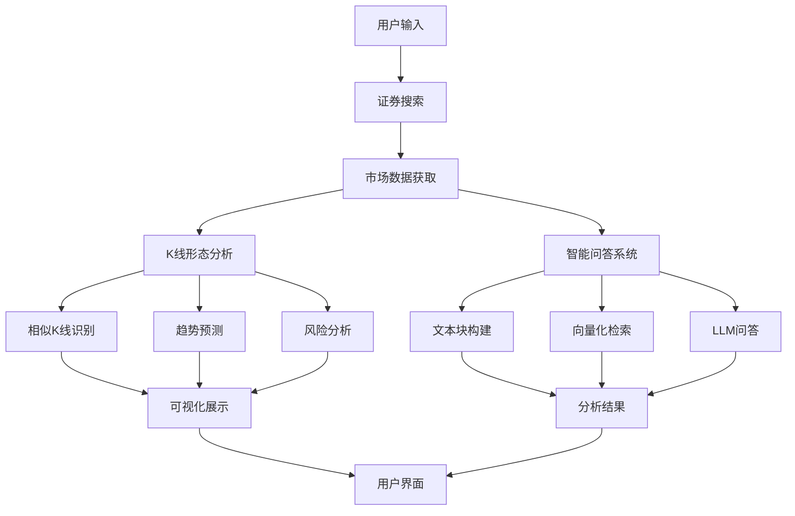

# 📈 A 股数据智能分析系统

## 👨‍💻 作者信息

姓名：吴小宇
学号：71265700016
课程：商业智能技术
老师：阮光册教授

## 🌟 系统简介

这是一个面向投资者的 A 股市场智能分析系统，旨在提供客观的市场分析和投资建议。💡 它的核心在于将传统的技术分析和现代人工智能相结合，为市场决策提供数据支持。

这个系统整合了技术分析 🔍 和智能问答 💬 功能，采用皮尔逊相关系数和欧氏距离等算法进行相似 K 线形态识别，结合基于统计概率的价格走势预测 📉，以及通过历史相似度匹配和风险度量（标准差/波动率）的持仓期分析 📊，并基于市场实时数据、RAG 检索增强生成和 GPT-4o-mini 的智能问答服务。

系统采用 TF-IDF 向量化、SVD 降维等机器学习算法和自然语言处理技术 🤖，致力于通过数据驱动的方式为投资决策提供参考。系统设计的目标是帮助投资者更全面地了解市场信息，理性权衡投资风险。⚖️

## 🔗 源码地址

[GitHub 仓库](https://github.com/mantoufan/yzhanSimilarKline)

## 🎥 Demo

> 接口限频限速，您可以搜索"**平安**""**上证指数**"查看。

- 其它关键词需要请求接口，大概需要等待 5 分钟甚至更长才有结果。⌛
- 本地运行速度更快 🚀

[Demo Link](https://skline.streamlit.app/) | [Video Link](https://drfs.ctcontents.com/file/3312/1449237316/62baf7/yun/business-ai-demo.mp4)  


## 🙏 致谢

特别感谢阮光册教授在商业智能技术课程中对相关技术和案例的讲解，受益匪浅。教授的指导帮助我更深入地理解了商业智能技术的实际应用，为本项目的开发提供了宝贵的理论依据和思路方向。👨‍🏫

## 📷 截图

  
  
  
  
  


## 🚀 快速开始

### 💻 安装步骤

1. 克隆项目代码

   ```bash
   git clone https://github.com/mantoufan/yzhanSimilarKline.git
   cd yzhanSimilarKline
   ```

2. 创建并激活虚拟环境

   ```bash
   python -m venv venv
   # Windows
   venv\Scripts\activate
   # Linux/Mac
   source venv/bin/activate
   ```

3. 安装依赖包

   ```bash
   pip install -r requirements.txt
   ```

4. 配置环境变量
   在项目根目录创建`.env`文件，添加必要的配置：

   ```
   API_KEY=your_api_key
   API_BASE=https://api.openai.com
   MODEL=gpt-4o-mini
   PROXY_URL=your_proxy_url # 可选，用于获取公开金融数据
   ```

5. 启动应用
   ```bash
   streamlit run streamlit_app.py
   ```

### 🕹️ 使用说明

1. **证券搜索**🔍：

   - 在搜索框输入股票代码或名称
   - 系统会显示匹配的证券列表，包括股票、指数和 ETF
   - 支持模糊搜索和智能匹配

2. **K 线分析**📈：

   - 点击感兴趣的证券查看详情
   - 查看 K 线图和相似形态分析
   - 研究趋势预测和风险分析结果

3. **智能问答**💬：

   - 在问答输入框输入您的问题
   - 系统会基于市场数据提供专业分析
   - 支持多轮对话和深度分析

4. **数据导出**📥：
   - 收益预测表可以导出 CSV
   - K 线图可以保存为 PNG 格式

### ⚠️ 使用提示

- 建议使用 Chrome 或 Firefox 浏览器获得最佳体验 👌
- 首次加载可能需要一些时间，请耐心等待缓存生成 ⏳
- 图表支持缩放、平移等交互操作 🖱️
- 智能问答支持多轮对话 💭

## 🏗️ 系统架构



## 🎯 核心功能

### 1. K 线形态识别与相似度匹配

系统采用滑动窗口方法结合多维相似度计算，识别和匹配历史 K 线形态。通过对价格序列进行标准化处理和相似度计算，找出最具参考价值的历史案例：

```python
def normalize_window(window):
    """
    对价格序列进行标准化处理

    算法原理：
    1. 将价格序列转换为同一基准
    2. 计算价格变化的百分比
    3. 使得不同时期、不同价位的K线可以进行比较

    输入：
    - window: pandas.Series，包含收盘价数据

    返回：
    - 标准化后的价格序列
    """
    numeric_window = pd.to_numeric(window, errors='coerce')
    if numeric_window.isna().any():
        return None
    # 相对于起始价格的变化百分比
    return (numeric_window - numeric_window.iloc[0]) / numeric_window.iloc[0] * 100

def calculate_similarity(window1, window2):
    """
    计算两个价格序列的相似度

    计算方法：
    1. 皮尔逊相关系数：衡量走势相关性（权重0.7）
    2. 欧氏距离：衡量形态差异（权重0.3）

    技术细节：
    - 使用scipy.stats.pearsonr计算相关系数
    - 使用scipy.spatial.distance.euclidean计算欧氏距离
    - 通过加权平均综合两个指标

    改进更新：
    - 添加数据有效性验证
    - 优化相似度计算逻辑
    - 增加异常处理机制

    输入：
    - window1, window2: 两个价格序列

    返回：
    - float: 相似度分数（0-1之间）
    """
    if len(window1) != len(window2):
        return 0

    # 标准化处理
    norm1 = normalize_window(window1)
    norm2 = normalize_window(window2)
    if norm1 is None or norm2 is None:
        return 0

    try:
        # 计算相关系数（-1到1之间）
        corr, _ = pearsonr(norm1, norm2)
        # 计算欧氏距离并归一化
        dist = euclidean(norm1, norm2)
        normalized_dist = 1 / (1 + dist/len(window1))
        # 加权平均得到最终相似度
        similarity = (corr + 1)/2 * 0.7 + normalized_dist * 0.3
        return similarity
    except:
        return 0
```

应用的核心技术：

- **时间序列处理**🕰️：使用 pandas 的 DatetimeIndex 和时间序列切片功能处理 K 线数据
- **统计学方法**📊：
  - 皮尔逊相关系数（scipy.stats.pearsonr）：衡量价格序列的走势相关性
  - 欧氏距离（scipy.spatial.distance.euclidean）：评估价格序列的形态差异
- **数据标准化**🎚️：使用基于首日价格的百分比变化进行序列标准化
- **加权评分系统**⚖️：综合相关系数（权重 0.7）和距离指标（权重 0.3）计算最终相似度

### 2. 智能问答系统增强

系统采用最新的 RAG（检索增强生成）技术架构，通过向量化检索和大语言模型的组合，实现基于市场数据的智能问答：

```python
def create_text_chunks(security, current_df, similar_patterns, holding_stats):
    """
    构建结构化文本块供检索（2024更新版）

    实现原理：
    1. 将不同类型的市场数据转换为结构化文本
    2. 对文本进行分块，便于后续检索
    3. 每个文本块包含特定主题的完整信息
    4. 新增风险分析和技术指标维度

    文本块类型：
    - 证券基本信息
    - 最新行情数据
    - 历史表现分析
    - 相似K线分析
    - 持仓收益分析
    - 技术指标分析（新增）
    - 风险评估报告（新增）

    参数：
    - security: dict，证券基本信息
    - current_df: DataFrame，当前市场数据
    - similar_patterns: list，相似K线分析结果
    - holding_stats: dict，持仓分析数据

    返回：
    - list：(chunk_id, chunk_text) 元组列表
    """
    chunks = []

    # 构建基本信息文本块
    basic_info = f"""
        证券基本信息：
        名称：{security['name']}
        代码：{security['code']}
        类型：{security['type']}
        交易所：{security['exchange']}
    """
    chunks.append(("basic_info", basic_info))

    if current_df is not None and not current_df.empty:
        # 添加最新行情信息
        latest_data = current_df.iloc[-1]
        latest_market = f"""
        最新市场行情（{latest_data['trade_date'].strftime('%Y-%m-%d')}）：
        收盘价：{latest_data['close']:.2f}
        开盘价：{latest_data['open']:.2f}
        最高价：{latest_data['high']:.2f}
        最低价：{latest_data['low']:.2f}
        成交量：{latest_data.get('volume', '未知')}
        """
        chunks.append(("latest_market", latest_market))

        # 添加其他分析维度...

    return chunks

class ChineseTextVectorizer:
    """
    中文文本向量化处理器（2024优化版）

    技术实现：
    1. 结合jieba分词和TF-IDF进行文本特征提取
    2. 使用SVD进行降维，获得稠密向量表示
    3. 对向量进行归一化，提高相似度计算的准确性
    4. 新增缓存机制，提升处理效率

    主要组件：
    - jieba：中文分词
    - TfidfVectorizer：文本特征提取
    - TruncatedSVD：降维处理
    - LRU缓存：优化性能
    """
    def __init__(self, vector_size=100):
        # TF-IDF向量化器配置
        self.tfidf = TfidfVectorizer(
            tokenizer=self._tokenize,  # 使用自定义分词器
            max_features=2000,  # 限制特征数量
            token_pattern=None  # 禁用默认的token模式
        )
        # SVD降维配置
        self.svd = TruncatedSVD(
            n_components=vector_size,  # 目标维度
            random_state=42  # 保证结果可重现
        )
        self.is_fitted = False

        # 预加载结巴词典
        jieba.initialize()

    @lru_cache(maxsize=1000)  # 缓存分词结果
    def _tokenize(self, text):
        """
        中文分词处理

        步骤：
        1. 清理文本中的特殊字符
        2. 使用jieba进行分词
        3. 过滤空白词
        4. 缓存处理结果
        """
        text = re.sub(r'[^\w\s]', '', text)
        words = jieba.lcut(text)
        return [w for w in words if w.strip()]
```

### 3. 数据处理优化

新增高效的数据缓存和多线程处理机制：

````python
@file_cache(cache_dir="./securities_cache", expire_days=30)
def load_security_data(security_type: str) -> pd.DataFrame:
    """
    加载证券数据，支持本地文件缓存

    参数：
        security_type: 证券类型 ('index', 'stock', 'etf')

    返回：
        pd.DataFrame: 包含证券信息的数据框
    """
    try:
        if security_type == 'index':
            return adata.stock.info.all_index_code()
        elif security_type == 'stock':
            return adata.stock.info.all_code()
        elif security_type == 'etf':
            return adata.fund.info.all_etf_exchange_traded_info()
        else:
            return pd.DataFrame()
    except Exception as e:
        print(f"加载{security_type}数据时出错: {str(e)}")
        return pd.DataFrame()

def search_securities(query: str) -> List[Dict]:
    """
    搜索证券(指数、股票)，支持多线程并行处理

    技术特点:
    1. 使用LRU缓存优化数据加载
    2. 多线程并行搜索提升性能
    3. 关键词预处理提高匹配准确性
    4. 异常处理确保功能稳定性
    5. 类型注解增强代码可读性

    Args:
        query: 搜索关键词(代码或名称)

    Returns:
        List[Dict]: 搜索结果列表，每个结果包含:
            - code: 证券代码
            - name: 证券名称
            - type: 证券类型
            - exchange: 交易所
    """
    if not query or len(query.strip()) == 0:
        return []

    # 预处理查询关键词
    query = preprocess_query(query)

    # 使用线程池并行搜索不同类型的证券
    security_types = ['index', 'stock', 'etf']
    with ThreadPoolExecutor(max_workers=2) as executor:
        futures = [
            executor.submit(search_single_type, query, security_type)
            for security_type in security_types
        ]

        # 收集所有结果
        all_results = []
        for future in futures:
            try:
                results = future.result()
                all_results.extend(results)
            except Exception as e:
                print(f"获取搜索结果时出错: {str(e)}")

    # 按相关度排序结果
    all_results.sort(key=lambda x: (
        -int(x['code'].lower() == query),  # 完全匹配代码的优先级最高
        -int(query in x['code'].lower()),  # 其次是包含代码的
        -int(query in x['name'].lower()),  # 再次是包含名称的
        len(x['code'])  # 最后按代码长度排序
    ))

    return all_results

### 4. 性能优化与缓存机制

系统引入了多层缓存机制和性能优化措施：

```python
def file_cache(cache_dir="./data_cache", expire_days=1):
    """
    文件缓存装饰器，将数据存储到本地文件系统

    技术特点：
    1. 支持自定义缓存目录和过期时间
    2. 使用JSON格式存储数据
    3. 自动处理缓存过期
    4. 异常处理机制确保稳定性

    参数：
        cache_dir: 缓存目录路径
        expire_days: 缓存过期天数，默认1天
    """
    def decorator(func):
        def wrapper(*args, **kwargs):
            # 创建缓存目录
            os.makedirs(cache_dir, exist_ok=True)

            # 构建缓存文件路径，使用函数名和参数作为缓存键
            cache_key = f"{func.__name__}_{str(args)}_{str(kwargs)}"
            cache_file = os.path.join(cache_dir, f"{cache_key}.json")
            meta_file = os.path.join(cache_dir, f"{cache_key}_meta.json")

            # 检查缓存是否存在且未过期
            if os.path.exists(cache_file) and os.path.exists(meta_file):
                with open(meta_file, 'r') as f:
                    meta = json.load(f)
                cache_time = datetime.strptime(meta['timestamp'],
                                             '%Y-%m-%d %H:%M:%S')

                # 如果缓存未过期，直接从文件加载数据
                if datetime.now() - cache_time < timedelta(days=expire_days):
                    try:
                        with open(cache_file, 'r') as f:
                            return json.load(f)
                    except Exception as e:
                        print(f"读取缓存文件出错: {str(e)}")

            # 如果缓存不存在或已过期，重新获取数据
            results = func(*args, **kwargs)

            # 保存数据到缓存文件
            try:
                # 保存数据
                with open(cache_file, 'w') as f:
                    json.dump(results, f, ensure_ascii=False, indent=2)

                # 保存元数据
                meta = {
                    'timestamp': datetime.now().strftime('%Y-%m-%d %H:%M:%S'),
                    'function': func.__name__,
                    'args': str(args),
                    'kwargs': str(kwargs)
                }
                with open(meta_file, 'w') as f:
                    json.dump(meta, f, ensure_ascii=False, indent=2)

            except Exception as e:
                print(f"写入缓存文件出错: {str(e)}")

            return results
        return wrapper
    return decorator
````

应用的核心技术：

1. **多层缓存机制**：

   - LRU 缓存：使用`@lru_cache`装饰器缓存频繁访问的数据
   - 文件缓存：通过`@file_cache`实现数据持久化存储
   - 向量化缓存：优化文本处理性能

2. **并行处理优化**：

   - 多线程搜索：并行处理不同类型的证券搜索
   - 异步数据加载：提高响应速度
   - 线程池管理：优化资源使用

3. **数据预处理改进**：
   - 证券代码标准化
   - 中文分词优化
   - 异常数据处理
   - 数据验证加强

## 📦 技术栈更新

### 核心框架与库

- Streamlit：Web 应用框架 🌐
- Plotly：交互式数据可视化 📊
- scikit-learn：机器学习算法库 🤖
- pandas & numpy：数据处理与科学计算 🧮
- jieba：中文分词处理 🀄
- ThreadPoolExecutor：多线程处理 🧵
- LRU Cache：内存缓存优化 💾

### 性能优化

1. **缓存机制**💾：
   - 内存缓存：`@lru_cache`装饰器
   - 文件缓存：`@file_cache`装饰器
   - 缓存过期管理 ⏰
   - 异常处理机制 🚨
2. **并行处理**🚀：

   - 多线程搜索 🔍
   - 异步数据加载 ⏳
   - 资源池管理 🏊‍♂️
   - 任务调度优化 🗓️

3. **数据处理**🧹：
   - 批量数据处理 📦
   - 向量化运算 🧮
   - 内存优化 💾
   - 错误处理完善 🔧

### AI 模型优化

1. **RAG 技术增强**🧠：

   - 改进文本块构建 📝
   - 优化向量检索 🔍
   - 增强相似度计算 📏
   - 完善提示工程 💡

2. **NLP 处理优化**🗣️：
   - 分词性能提升 🚄
   - 向量化效率优化 ⚡
   - 相似度算法改进 🧮
   - 结果排序优化 🏆

## ⭐ 系统特点

1. **高性能数据处理**🚀：
   - 多级缓存机制 💾
   - 多线程并行处理 🧵
   - 异步数据加载 ⏳
   - 性能监控优化 📈
2. **智能分析增强**🧠：

   - 改进相似度算法 🧮
   - 优化文本检索精度 🎯
   - 完善风险分析模型 ⚠️
   - 增强预测准确性 📉

3. **用户体验优化**👨‍💻：
   - 响应速度提升 ⚡
   - 分析结果更专业 📊
   - 展示效果更直观 📈
   - 操作更加便捷 🖱️

## ⚠️ 注意事项

1. 所有分析结果仅供参考，不构成投资建议 ❌
2. 过往表现不代表未来收益 📉
3. 投资有风险，入市需谨慎 ⚠️
