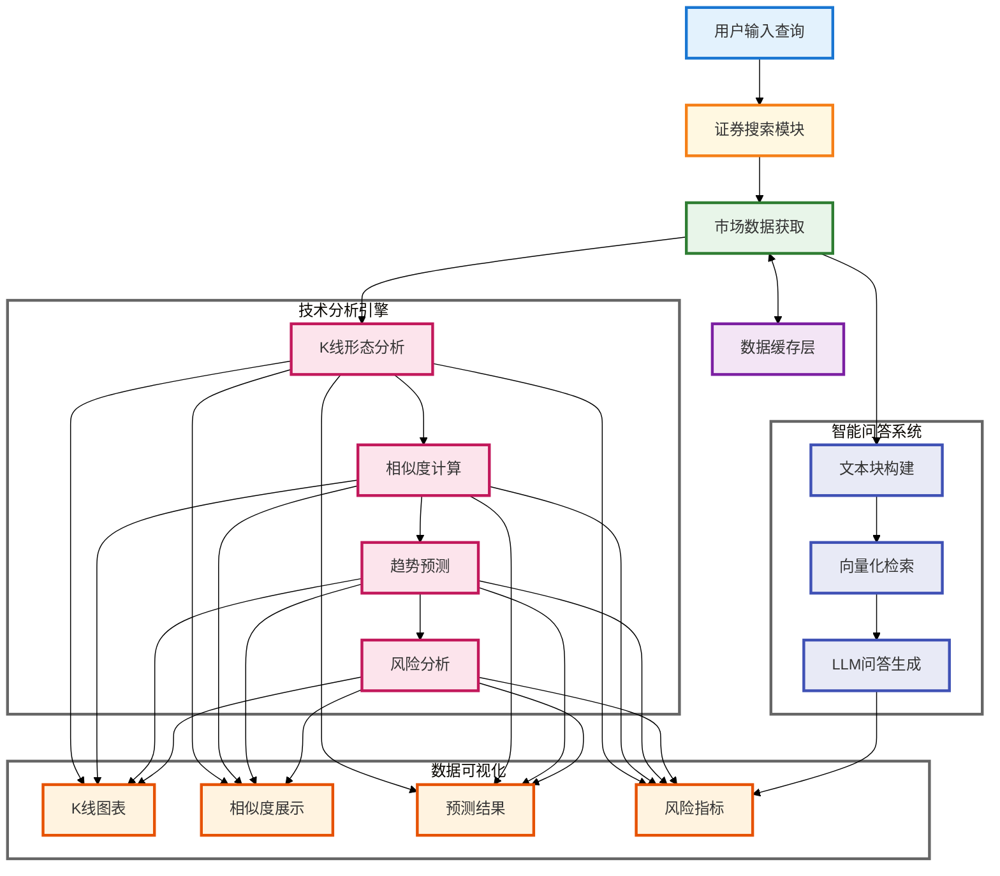

# 📈 A 股数据智能分析系统

## 📑 目录

1. [作者信息](#-作者信息)
2. [系统简介](#-系统简介)
3. [源码地址](#-源码地址)
4. [Demo 演示](#-demo)
5. [致谢](#-致谢)
6. [步骤演示](#-步骤演示)
7. [快速开始](#-快速开始)
   - [安装步骤](#-安装步骤)
   - [使用说明](#-使用说明)
   - [使用提示](#-使用提示)
8. [系统架构](#-系统架构)
9. [核心技术实现](#-核心技术实现)
   - [K 线形态识别与相似度匹配](#1-k-线形态识别与相似度匹配)
   - [市场收益预测](#2-市场收益预测)
   - [智能问答系统](#3-智能问答系统)
   - [数据处理优化](#4-数据处理优化)
   - [性能优化与缓存机制](#5-性能优化与缓存机制)
10. [系统特点](#-系统特点)
11. [注意事项](#-注意事项)
12. [总结与展望](#-总结与展望)

## 👨‍💻 作者信息

课程：商业智能技术　老师：阮光册教授  
姓名：吴小宇　学号：71265700016 　[项目演示](http://a.os120.com)　[源码和说明](https://github.com/mantoufan/yzhanSimilarKline)

## 🌟 系统简介

这是一个面向投资者的 A 股市场智能分析系统，旨在提供客观的市场分析和投资建议。💡 它的核心在于将传统的技术分析和现代人工智能相结合，为市场决策提供数据支持。

这个系统整合了技术分析 🔍 和智能问答 💬 功能，采用皮尔逊相关系数和欧氏距离等算法进行相似 K 线形态识别，结合基于统计概率的价格走势预测 📉，以及通过历史相似度匹配和风险度量（标准差/波动率）的持仓期分析 📊，并基于市场实时数据、RAG 检索增强生成和 GPT-4o-mini 的智能问答服务。

系统采用 TF-IDF 向量化、SVD 降维等机器学习算法和自然语言处理技术 🤖，致力于通过数据驱动的方式为投资决策提供参考。系统设计的目标是帮助投资者更全面地了解市场信息，理性权衡投资风险。⚖️

## 🔗 源码地址

[GitHub 仓库](https://github.com/mantoufan/yzhanSimilarKline)

## 🎥 Demo

在线使用：[阿里云节点（推荐，高速）](https://a.os120.com/)　[谷歌云节点（慢）](https://skline.streamlit.app/)  
视频演示：[点击播放](https://drfs.ctcontents.com/file/3312/1449317425/0a8f12/yun/business-ai-video-v2.mp4)  
动画演示（[不动点这里](https://github.com/user-attachments/assets/50e9544a-aafa-4a3b-ad3f-8b71cc1cd79e)）


## 🙏 致谢

特别感谢阮光册教授在商业智能技术课程中对相关技术和案例的讲解，受益匪浅。教授的指导帮助我更深入地理解了商业智能技术的实际应用，为本项目的开发提供了宝贵的理论依据和思路方向。👨‍🏫

## 📷 步骤演示

步骤 1：搜索 平安 / 上证指数 关键词，其它关键词没有缓存可能要等 5 分钟  


步骤 2：下拉查看历史相似 K 线图  


步骤 3：基于最相似的 10 条历史 K 线，预测未来 7 个交易日的涨跌情况  


步骤 4：如果当前交易日（非交易日最近），持有 1 - 7 交易日的收益率和胜率  


步骤 5：据用户输入问题，查询最相似的，将结构化数据语义化的不同类型的数据块，嵌入提示词  


步骤 6：根据内置 + 问题 + 嵌入数据块的提示词发给 GPT-4o-mini，返回结果


## 🚀 快速开始

### 💻 安装步骤

1. 克隆项目代码

```bash
git clone https://github.com/mantoufan/yzhanSimilarKline.git
cd yzhanSimilarKline
```

2. 创建并激活虚拟环境

```bash
python -m venv venv
# Windows
venv\Scripts\activate
# Linux/Mac
source venv/bin/activate
```

3. 安装依赖包

```bash
pip install -r requirements.txt
```

4. 配置环境变量
   在项目根目录创建`.env`文件，添加必要的配置：

```
API_KEY=your_api_key
API_BASE=https://api.openai.com
MODEL=gpt-4o-mini
PROXY_URL=your_proxy_url # 可选，用于获取公开金融数据
```

5. 启动应用

```bash
streamlit run streamlit_app.py
```

### 🕹️ 使用说明

1. **证券搜索**🔍：

   - 在搜索框输入股票代码或名称
   - 系统会显示匹配的证券列表，包括股票、指数和 ETF
   - 支持模糊搜索和智能匹配

2. **K 线分析**📈：

   - 点击感兴趣的证券查看详情
   - 查看 K 线图和相似形态分析
   - 研究趋势预测和风险分析结果

3. **智能问答**💬：

   - 在问答输入框输入您的问题
   - 系统会基于市场数据提供专业分析
   - 支持多轮对话和深度分析

4. **数据导出**📥：
   - 收益预测表可以导出 CSV
   - K 线图可以保存为 PNG 格式

### ⚠️ 使用提示

- 建议使用 Chrome 或 Firefox 浏览器获得最佳体验 👌
- 首次加载可能需要一些时间，请耐心等待缓存生成 ⏳
- 图表支持缩放、平移等交互操作 🖱️
- 智能问答支持多轮对话 💭

## 🏗️ 系统架构



## 📦 核心技术实现

### 1. K 线形态识别与相似度匹配

系统使用皮尔逊相关系数和欧氏距离的组合方法来识别相似 K 线形态。通过对价格序列进行标准化处理，使得不同时期、不同价位的 K 线可以进行比较：

```python
def normalize_window(window):
    """对价格序列进行标准化处理"""
    numeric_window = pd.to_numeric(window, errors='coerce')
    if numeric_window.isna().any():
        return None
    return (numeric_window - numeric_window.iloc[0]) / numeric_window.iloc[0] * 100

def calculate_similarity(window1, window2):
    """计算两个价格序列的相似度"""
    if len(window1) != len(window2):
        return 0

    norm1 = normalize_window(window1)
    norm2 = normalize_window(window2)

    if norm1 is None or norm2 is None:
        return 0

    try:
        # 计算相关系数（-1到1之间）
        corr, _ = pearsonr(norm1, norm2)
        # 计算欧氏距离并归一化
        dist = euclidean(norm1, norm2)
        normalized_dist = 1 / (1 + dist/len(window1))
        # 加权平均得到最终相似度
        similarity = (corr + 1)/2 * 0.7 + normalized_dist * 0.3
        return similarity
    except:
        return 0
```

核心技术特点：

- **时间序列处理**🕰️：使用 pandas 的 DatetimeIndex 处理 K 线数据
- **统计学方法**📊：
  - 皮尔逊相关系数：衡量价格序列的走势相关性
  - 欧氏距离：评估价格序列的形态差异
- **数据标准化**🎚️：基于首日价格的百分比变化

### 2. 市场收益预测

系统采用多维度的技术方法来分析和预测市场收益：

```python
def analyze_holding_returns(similar_patterns):
    """
    分析不同持有期的收益情况

    技术要点：
    1. 持仓期收益率计算：评估不同时间周期的收益表现
    2. 风险度量：使用标准差/波动率评估投资风险
    3. 胜率统计：分析不同持有期的盈利概率
    """
    stats = {str(i): {
        'returns': [],
        'max_prices': [],
        'min_prices': [],
        'win_count': 0,
        'loss_count': 0,
    } for i in range(1, 8)}

    for pattern in similar_patterns:
        entry_price = pattern['pattern_data'].iloc[-1]['close']
        future_data = pattern['future_data']

        for days in range(1, 8):
            day_key = str(days)
            if days <= len(future_data):
                holding_period_data = future_data.iloc[:days]
                exit_price = holding_period_data.iloc[-1]['close']
                returns = (exit_price - entry_price) / entry_price * 100

                stats[day_key]['returns'].append(returns)

                if returns > 0:
                    stats[day_key]['win_count'] += 1
                else:
                    stats[day_key]['loss_count'] += 1

                stats[day_key]['max_prices'].append(
                    holding_period_data['high'].max()
                )
                stats[day_key]['min_prices'].append(
                    holding_period_data['low'].min()
                )

    # 计算统计指标
    analysis_results = {}
    for days, day_stats in stats.items():
        returns_array = np.array(day_stats['returns'])
        total_trades = len(returns_array)

        if total_trades > 0:
            analysis_results[days] = {
                'avg_return': np.mean(returns_array),
                'max_return': np.max(returns_array),
                'min_return': np.min(returns_array),
                'std_return': np.std(returns_array),
                'win_rate': day_stats['win_count'] / total_trades,
                'trade_count': total_trades,
                'max_price_change': (
                    np.max(day_stats['max_prices']) - entry_price
                ) / entry_price * 100,
                'min_price_change': (
                    np.min(day_stats['min_prices']) - entry_price
                ) / entry_price * 100
            }

    return analysis_results

def analyze_future_trends(similar_patterns):
    """
    基于历史K线分析未来可能的走势

    技术要点：
    1. 历史模式匹配：基于相似K线的历史表现
    2. 统计概率分析：计算涨跌概率和幅度分布
    3. 趋势预测建模：构建未来可能的走势预测
    """
    if not similar_patterns:
        return None

    stats = {
        'up': {str(i): {
            'count': 0, 'max': 0, 'min': float('inf'),
            'mean': 0, 'values': []
        } for i in range(1, 8)},
        'down': {str(i): {
            'count': 0, 'max': 0, 'min': float('inf'),
            'mean': 0, 'values': []
        } for i in range(1, 8)}
    }

    # 统计历史走势数据
    for pattern in similar_patterns:
        future_data = pattern['future_data']

        for i in range(len(future_data)):
            day = str(i + 1)
            current_price = future_data.iloc[i]['close']
            prev_price = (
                pattern['pattern_data'].iloc[-1]['close']
                if i == 0
                else future_data.iloc[i-1]['close']
            )

            change_rate = (
                (current_price - prev_price) / prev_price
            ) * 100

            category = 'up' if change_rate >= 0 else 'down'
            change_rate = abs(change_rate)

            stats[category][day]['count'] += 1
            stats[category][day]['values'].append(change_rate)
            stats[category][day]['max'] = max(
                stats[category][day]['max'],
                change_rate
            )
            stats[category][day]['min'] = min(
                stats[category][day]['min'],
                change_rate
            )

    # 计算统计指标
    total_patterns = len(similar_patterns)
    for category in ['up', 'down']:
        for day in stats[category]:
            day_stats = stats[category][day]
            if day_stats['count'] > 0:
                day_stats['probability'] = (
                    day_stats['count'] / total_patterns
                )
                day_stats['mean'] = (
                    sum(day_stats['values']) / day_stats['count']
                )

                # 计算众数(最可能出现的涨跌幅)
                rounded_values = [
                    round(x, 2) for x in day_stats['values']
                ]
                value_counts = {}
                for v in rounded_values:
                    value_counts[v] = value_counts.get(v, 0) + 1
                day_stats['mode'] = max(
                    value_counts.items(),
                    key=lambda x: x[1]
                )[0]

            del day_stats['values']  # 清理原始数据，只保留统计结果

    return stats
```

收益预测的关键技术特点：

- **多维度分析**：

  - 持仓期收益率计算：评估不同时间周期的收益表现
  - 风险度量：使用标准差衡量波动风险
  - 概率统计：计算胜率和最可能出现的涨跌幅
  - 趋势预测：基于历史相似形态预测未来走势

- **风险评估指标**：

  - 标准差：衡量收益率的波动性
  - 最大回撤：计算可能的最大损失
  - 胜率：统计盈利的概率
  - 收益分布：分析收益的离散程度

- **预测模型特点**：
  - 基于历史相似度的模式识别
  - 概率分布的统计分析
  - 多周期的收益率计算
  - 动态的风险收益评估

### 3. 智能问答系统

系统采用 RAG（检索增强生成）技术架构，结合向量化检索和大语言模型：

```python
def get_analysis_prompt(query, relevant_chunks, chat_history=None):
    """
    构建带有检索上下文和对话历史的分析提示

    技术要点：
    1. 对话历史管理：追踪并关联多轮对话信息
    2. 上下文整合：将历史对话与当前问题结合
    3. 提示词工程：构建结构化的分析指令
    """
    # 基础市场数据上下文
    context = "\n".join([chunk for _, chunk in relevant_chunks])

    # 构建基础提示词
    prompt = f"""作为一位专业的金融分析师，请基于以下相关市场数据回答用户问题。

要求：
1. 只使用提供的数据进行分析，不要添加其他市场信息
2. 明确区分数据支持的结论和不确定的推测
3. 如果数据不足以回答问题，请明确指出
4. 适当提醒投资风险

相关市场数据：
{context}
"""

    # 整合对话历史
    if chat_history and len(chat_history) > 0:
        prompt += "\n对话历史：\n"
        for i, (user_msg, assistant_msg) in enumerate(chat_history, 1):
            prompt += f"第{i}轮问答：\n"
            prompt += f"用户：{user_msg}\n"
            prompt += f"助手：{assistant_msg}\n"

    # 添加当前问题
    prompt += f"\n当前用户问题：{query}"

    # 添加角色指示
    prompt += """

请基于以上信息和对话历史，遵循以下原则回答：
1. 用专业且通俗的语言回答问题，确保分析逻辑清晰
2. 如果涉及到之前的对话内容，请保持分析的连贯性
3. 在回答中适当提供一些思考的切入点，引导用户进行更深入的提问
4. 如果用户追问某个观点，请进一步展开解释背后的原理和依据
5. 如果某个分析涉及到多个方面，可以明确指出，方便用户选择感兴趣的方向继续探讨
"""

    return prompt
```

智能问答系统的核心技术特点：

- **RAG 检索增强生成**：

  - 文本块构建：将市场数据结构化为可检索的文本块
  - 向量化检索：使用 TF-IDF 和 SVD 进行文本向量化
  - 相似度匹配：基于余弦相似度查找相关内容

- **多轮对话管理**：
  - 会话状态维护：使用 session_state 保存对话历史
  - 上下文关联：将历史对话融入当前分析
  - 动态提示词：根据对话历史调整回答策略

### 4. 数据处理优化

系统实现了多重优化机制来提升数据处理效率：

```python
@file_cache(cache_dir="./securities_cache", expire_days=30)
def load_security_data(security_type: str) -> pd.DataFrame:
    """加载证券数据，支持本地文件缓存"""
    try:
        if security_type == 'index':
            return adata.stock.info.all_index_code()
        elif security_type == 'stock':
            return adata.stock.info.all_code()
        elif security_type == 'etf':
            return adata.fund.info.all_etf_exchange_traded_info()
        else:
            return pd.DataFrame()
    except Exception as e:
        print(f"加载{security_type}数据时出错: {str(e)}")
        return pd.DataFrame()

class ChineseTextVectorizer:
    """中文文本向量化处理器"""
    def __init__(self, vector_size=100):
        self.tfidf = TfidfVectorizer(
            tokenizer=self._parallel_tokenize,
            max_features=2000
        )
        self.svd = TruncatedSVD(
            n_components=vector_size,
            random_state=42
        )
        self.is_fitted = False
        jieba.initialize()

    def _parallel_tokenize(self, text):
        """并行分词处理器"""
        if len(text) < 1000:
            return self._tokenize(text)

        chunks = self._split_text(text)
        with ThreadPoolExecutor(max_workers=4) as executor:
            results = list(executor.map(self._tokenize, chunks))
        return [token for chunk_result in results for token in chunk_result]
```

### 5. 性能优化与缓存机制

系统采用多层缓存策略提升性能：

```python
def file_cache(cache_dir="./data_cache", expire_days=1):
    """
    文件缓存装饰器

    技术特点：
    1. 支持文件系统缓存
    2. 可配置过期时间
    3. 自动创建缓存目录
    4. 异常处理和容错机制
    """
    def decorator(func):
        def wrapper(*args, **kwargs):
            # 创建缓存目录
            os.makedirs(cache_dir, exist_ok=True)

            # 构建缓存文件路径
            cache_key = f"{func.__name__}_{str(args)}_{str(kwargs)}"
            cache_file = os.path.join(cache_dir, f"{cache_key}.json")
            meta_file = os.path.join(cache_dir, f"{cache_key}_meta.json")

            # 检查缓存是否存在且未过期
            if os.path.exists(cache_file) and os.path.exists(meta_file):
                with open(meta_file, 'r') as f:
                    meta = json.load(f)
                cache_time = datetime.strptime(
                    meta['timestamp'],
                    '%Y-%m-%d %H:%M:%S'
                )

                # 如果缓存未过期，直接返回缓存数据
                if datetime.now() - cache_time < timedelta(days=expire_days):
                    with open(cache_file, 'r') as f:
                        return json.load(f)

            # 获取新数据
            results = func(*args, **kwargs)

            # 保存到缓存
            try:
                with open(cache_file, 'w') as f:
                    json.dump(results, f, ensure_ascii=False, indent=2)

                meta = {
                    'timestamp': datetime.now().strftime('%Y-%m-%d %H:%M:%S'),
                    'function': func.__name__,
                    'args': str(args),
                    'kwargs': str(kwargs)
                }
                with open(meta_file, 'w') as f:
                    json.dump(meta, f, ensure_ascii=False, indent=2)

            except Exception as e:
                print(f"写入缓存文件出错: {str(e)}")

            return results
        return wrapper
    return decorator
```

## ⭐ 系统特点

1. **高效数据处理**🚀：

   - 文件缓存机制，提高数据加载速度 💾
   - 使用线程池并行搜索不同类型证券 🧵
   - LRU 缓存优化分词结果 ⏳
   - 长文本的并行分词处理 ⚡

2. **精准分析引擎**🧮：

   - 基于皮尔逊相关系数和欧氏距离的 K 线相似度计算，实现了精确的形态识别
   - TF-IDF 和 SVD 的文本向量化处理，提供了高质量的语义检索
   - 基于统计模型的风险收益分析，为投资决策提供数据支持
   - 多维度的趋势预测和风险评估，帮助投资者全面了解市场状况

3. **用户友好界面**👨‍💻：

   - 清晰的数据可视化展示，让复杂的市场数据更易理解
   - 简洁的搜索功能，支持模糊匹配和智能排序
   - 智能的问答系统，能够进行自然流畅的多轮对话
   - 交互式图表设计，支持缩放、平移等操作
   - 专业分析与通俗解释相结合，照顾不同层次用户需求

4. **高性能架构**⚡：
   - 多层缓存设计，显著提升数据访问速度
   - 并行处理机制，优化大规模数据分析性能
   - 模块化架构，便于功能扩展和维护
   - 异常处理机制，确保系统稳定运行

## ⚠️ 注意事项

1. **数据使用声明**📋：

   - 系统使用的市场数据仅供参考，不构成投资建议
   - 历史数据分析结果不能预示未来市场表现
   - 用户需要自行承担投资决策的风险
   - 建议结合其他分析工具和专业意见进行投资决策

2. **系统局限性**🔍：

   - K 线形态识别基于历史数据，可能存在滞后性
   - 市场环境变化可能影响历史模式的有效性
   - 技术分析需要配合基本面分析使用
   - 不同市场阶段的预测准确度可能有所差异

3. **使用建议**💡：
   - 建议将系统作为决策参考工具之一
   - 重视风险管理，不要过分依赖单一指标
   - 定期检验和调整投资策略
   - 保持理性思考，避免情绪化决策

## 🎉 总结与展望

在 A 股智能分析系统的开发过程中，本项目成功将传统技术分析与现代人工智能技术相结合，主要取得了以下成果：

1. **技术创新**🔬：

   - 实现了基于皮尔逊相关系数和欧氏距离的 K 线形态识别
   - 构建了高效的文件缓存系统提升数据加载性能
   - 开发了基于 TF-IDF 和 SVD 的智能问答系统
   - 集成了市场数据分析和风险评估功能

2. **实际应用**💼：

   - 系统可以有效识别市场中的相似 K 线形态
   - 提供了客观的收益风险分析数据
   - 支持自然语言的市场分析对话
   - 实现了直观的数据可视化展示

3. **未来改进方向**🚀：

   a. 接口性能优化：

   - 升级到更快的数据服务提供商
   - 优化数据缓存策略
   - 实现增量数据更新机制
   - 添加数据预加载功能

   b. 框架升级：

   - 评估更高性能的 Web 框架
   - 优化前端渲染性能
   - 改进用户界面交互体验
   - 增强移动端适配能力

   c. 分析功能增强：

   - 引入更多技术指标分析
   - 添加市场情绪分析
   - 集成基本面数据分析
   - 提供更全面的市场洞察

   d. AI 模型优化：

   - 探索更先进的自然语言处理模型
   - 增强多轮对话的连贯性
   - 提升问答质量和准确度
   - 添加个性化分析推荐

总的来说，这个项目成功实现了技术分析与人工智能的基础结合，为投资决策提供了数据支持。通过不断优化和完善，系统将继续朝着更专业、更智能的方向发展，为投资者提供更有价值的市场分析工具。我相信，随着技术的进步和市场的发展，这类智能分析系统将在投资决策中发挥越来越重要的作用。
