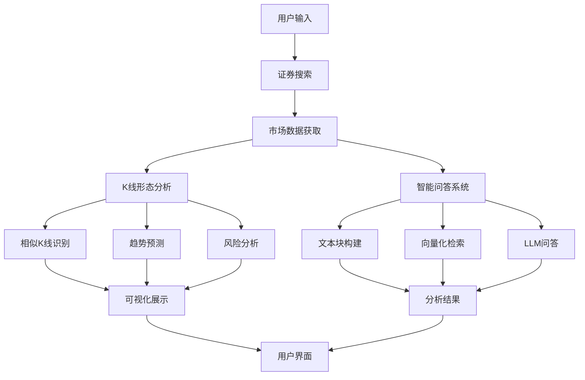

# A 股数据智能分析系统

## 系统简介

这是一个基于人工智能和大数据技术的 A 股市场分析系统，集成了技术分析和智能问答功能。系统能够自动识别相似 K 线形态，预测可能的价格走势，分析不同持仓期的风险收益，并提供基于实际市场数据的智能问答服务。系统采用先进的机器学习算法和自然语言处理技术，为投资者提供客观、全面的市场分析支持。系统整合了多种技术指标和分析方法，通过数据驱动的方式帮助投资者做出更理性的投资决策。

## 致谢

特别感谢阮光册教授在商业智能技术课程中对相关技术和案例的讲解，受益匪浅。教授的指导帮助我更深入地理解了商业智能技术的实际应用，为本项目的开发提供了宝贵的理论依据和思路方向。

## 快速开始

### 安装步骤

1. 克隆项目代码

```bash
git clone https://github.com/mantoufan/yzhanSimilarKline.git
cd yzhanSimilarKline
```

2. 创建并激活虚拟环境

```bash
python -m venv venv
# Windows
venv\Scripts\activate
# Linux/Mac
source venv/bin/activate
```

3. 安装依赖包

```bash
pip install -r requirements.txt
```

4. 配置环境变量
   在项目根目录创建`.env`文件，添加必要的配置：

```plaintext
API_KEY=your_api_key
API_BASE=https://api.openai.com
MODEL=gpt-4
```

5. 启动应用

```bash
streamlit run app.py
```

### 使用说明

1. **证券搜索**：

   - 在搜索框输入股票代码或名称
   - 系统会显示匹配的证券列表

2. **K 线分析**：

   - 点击感兴趣的证券查看详情
   - 查看 K 线图和相似形态分析
   - 研究趋势预测和风险分析结果

3. **智能问答**：

   - 在问答输入框输入您的问题
   - 系统会基于市场数据提供专业分析

4. **数据导出**：
   - 收益预测表可以导出 CSV
   - K 线图可以保存为 PNG 格式

### 使用提示

- 建议使用 Chrome 或 Firefox 浏览器获得最佳体验
- 首次加载可能需要一些时间，请耐心等待
- 图表支持缩放、平移等交互操作
- 智能问答支持多轮对话

## 系统架构



## 核心功能

### 1. K 线形态识别与相似度匹配

系统采用滑动窗口方法结合多维相似度计算，识别和匹配历史 K 线形态。通过对价格序列进行标准化处理和相似度计算，找出最具参考价值的历史案例：

```python
def normalize_window(window):
    """
    对价格序列进行标准化处理

    算法原理：
    1. 将价格序列转换为同一基准
    2. 计算价格变化的百分比
    3. 使得不同时期、不同价位的K线可以进行比较

    输入：
    - window: pandas.Series，包含收盘价数据

    返回：
    - 标准化后的价格序列
    """
    numeric_window = pd.to_numeric(window, errors='coerce')
    if numeric_window.isna().any():
        return None
    # 相对于起始价格的变化百分比
    return (numeric_window - numeric_window.iloc[0]) / numeric_window.iloc[0] * 100

def calculate_similarity(window1, window2):
    """
    计算两个价格序列的相似度

    计算方法：
    1. 皮尔逊相关系数：衡量走势相关性（权重0.7）
    2. 欧氏距离：衡量形态差异（权重0.3）

    技术细节：
    - 使用scipy.stats.pearsonr计算相关系数
    - 使用scipy.spatial.distance.euclidean计算欧氏距离
    - 通过加权平均综合两个指标

    输入：
    - window1, window2: 两个价格序列

    返回：
    - float: 相似度分数（0-1之间）
    """
    if len(window1) != len(window2):
        return 0

    # 标准化处理
    norm1 = normalize_window(window1)
    norm2 = normalize_window(window2)
    if norm1 is None or norm2 is None:
        return 0

    try:
        # 计算相关系数（-1到1之间）
        corr, _ = pearsonr(norm1, norm2)
        # 计算欧氏距离并归一化
        dist = euclidean(norm1, norm2)
        normalized_dist = 1 / (1 + dist/len(window1))
        # 加权平均得到最终相似度
        similarity = (corr + 1)/2 * 0.7 + normalized_dist * 0.3
        return similarity
    except:
        return 0

def find_similar_patterns(df, window_size=30, top_n=3):
    """
    查找最相似的历史K线模式

    实现流程：
    1. 提取当前市场的最近K线数据
    2. 使用滑动窗口遍历历史数据
    3. 对每个历史片段计算与当前K线的相似度
    4. 保存并返回相似度最高的记录

    技术要点：
    - 使用pandas的时间序列切片功能
    - 实现滑动窗口扫描
    - 动态计算相似度得分
    - 维护相似度排序

    参数：
    - df: pandas.DataFrame，包含OHLCV数据
    - window_size: int，比较窗口的大小
    - top_n: int，返回的最相似记录数量

    返回：
    - list：包含相似K线的详细信息
    """
    # 获取最近的价格窗口
    recent_window = df.tail(window_size)['close']
    similar_patterns = []

    # 预留足够的未来数据用于分析（窗口大小的2倍加7天）
    max_i = len(df) - (window_size * 2 + 7)

    # 遍历历史数据寻找相似模式
    for i in range(max_i):
        # 提取历史窗口数据
        historical_window = df.iloc[i:i+window_size]['close']
        future_data = df.iloc[i+window_size:i+window_size+7]

        # 跳过数据不完整的情况
        if len(future_data) < 7:
            continue

        # 计算相似度
        similarity = calculate_similarity(recent_window, historical_window)

        # 保存相似度高于0的模式
        if similarity > 0:
            similar_patterns.append({
                'start_date': df.iloc[i]['trade_date'],  # 历史片段的开始日期
                'end_date': df.iloc[i+window_size-1]['trade_date'],  # 结束日期
                'similarity': similarity,  # 相似度得分
                'pattern_data': df.iloc[i:i+window_size],  # 历史K线数据
                'future_data': future_data  # 后续7天数据用于分析
            })

    # 按相似度排序并返回前top_n个结果
    similar_patterns.sort(key=lambda x: x['similarity'], reverse=True)
    return similar_patterns[:top_n]
```

应用的核心技术：

- **时间序列处理**：使用 pandas 的 DatetimeIndex 和时间序列切片功能处理 K 线数据
- **统计学方法**：
  - 皮尔逊相关系数（scipy.stats.pearsonr）：衡量价格序列的走势相关性
  - 欧氏距离（scipy.spatial.distance.euclidean）：评估价格序列的形态差异
- **数据标准化**：使用基于首日价格的百分比变化进行序列标准化
- **加权评分系统**：综合相关系数（权重 0.7）和距离指标（权重 0.3）计算最终相似度

关键技术：

- 时间序列标准化：将不同时期的价格序列转换为可比较的形式，消除基期差异影响
- 欧几里得距离：计算价格序列间的距离相似度，评估走势形态的接近程度
- 皮尔逊相关系数：评估走势的相关性，衡量价格变动的一致性
- 综合评分机制：结合多个指标计算最终相似度，提高匹配的准确性

### 2. 智能问答系统

系统采用 RAG（检索增强生成）技术架构，通过向量化检索和大语言模型的组合，实现基于市场数据的智能问答：

```python
def create_text_chunks(security, current_df, similar_patterns, holding_stats):
    """
    构建结构化文本块供检索

    实现原理：
    1. 将不同类型的市场数据转换为结构化文本
    2. 对文本进行分块，便于后续检索
    3. 每个文本块包含特定主题的完整信息

    文本块类型：
    - 证券基本信息
    - 最新行情数据
    - 历史表现分析
    - 相似K线分析
    - 持仓收益分析

    参数：
    - security: dict，证券基本信息
    - current_df: DataFrame，当前市场数据
    - similar_patterns: list，相似K线分析结果
    - holding_stats: dict，持仓分析数据

    返回：
    - list：(chunk_id, chunk_text) 元组列表
    """
    chunks = []

    # 构建基本信息文本块
    basic_info = f"""
        证券基本信息：
        名称：{security['name']}
        代码：{security['code']}
        类型：{security['type']}
        交易所：{security['exchange']}
    """
    chunks.append(("basic_info", basic_info))

    if current_df is not None and not current_df.empty:
        # 添加最新行情信息
        latest_data = current_df.iloc[-1]
        latest_market = f"""
        最新市场行情（{latest_data['trade_date'].strftime('%Y-%m-%d')}）：
        收盘价：{latest_data['close']:.2f}
        开盘价：{latest_data['open']:.2f}
        最高价：{latest_data['high']:.2f}
        最低价：{latest_data['low']:.2f}
        成交量：{latest_data.get('volume', '未知')}
        """
        chunks.append(("latest_market", latest_market))

        # 其他文本块构建...

    return chunks

class ChineseTextVectorizer:
    """
    中文文本向量化处理器

    技术实现：
    1. 结合jieba分词和TF-IDF进行文本特征提取
    2. 使用SVD进行降维，获得稠密向量表示
    3. 对向量进行归一化，提高相似度计算的准确性

    主要组件：
    - jieba：中文分词
    - TfidfVectorizer：文本特征提取
    - TruncatedSVD：降维处理
    """
    def __init__(self, vector_size=100):
        # TF-IDF向量化器配置
        self.tfidf = TfidfVectorizer(
            tokenizer=self._tokenize,  # 使用自定义分词器
            max_features=5000,  # 限制特征数量
            token_pattern=None  # 禁用默认的token模式
        )
        # SVD降维配置
        self.svd = TruncatedSVD(
            n_components=vector_size,  # 目标维度
            random_state=42  # 保证结果可重现
        )
        self.is_fitted = False

    def _tokenize(self, text):
        """
        中文分词处理

        步骤：
        1. 清理文本中的特殊字符
        2. 使用jieba进行分词
        3. 过滤空白词
        """
        text = re.sub(r'[^\w\s]', '', text)
        words = jieba.cut(text)
        return [w for w in words if w.strip()]

    def fit(self, texts):
        """训练向量化模型"""
        tfidf_matrix = self.tfidf.fit_transform(texts)
        self.svd.fit(tfidf_matrix)
        self.is_fitted = True

    def transform(self, text):
        """
        将文本转换为向量表示

        步骤：
        1. TF-IDF转换
        2. SVD降维
        3. 向量归一化

        返回：
        - 归一化的向量表示
        """
        tfidf_vector = self.tfidf.transform([text])
        vector = self.svd.transform(tfidf_vector)
        # 向量归一化
        norm = np.linalg.norm(vector)
        if norm > 0:
            vector = vector / norm
        return vector.flatten()

def retrieve_relevant_chunks(query, chunks, top_k=3):
    """
    检索与查询最相关的文本块

    实现流程：
    1. 初始化向量化器
    2. 将查询和所有文本块转换为向量
    3. 计算相似度并排序
    4. 返回最相关的文本块

    参数：
    - query: str，用户查询
    - chunks: list，(chunk_id, text) 元组列表
    - top_k: int，返回的最相关文本块数量

    返回：
    - list：最相关的文本块列表
    """
    vectorizer = ChineseTextVectorizer()
    # 将查询和所有文本块一起训练，确保词汇表的完整性
    all_texts = [query] + [chunk_text for _, chunk_text in chunks]
    vectorizer.fit(all_texts)

    # 获取查询的向量表示
    query_embedding = compute_embedding(query, vectorizer)

    # 计算每个文本块与查询的相似度
    similarities = []
    for chunk_id, chunk_text in chunks:
        chunk_embedding = compute_embedding(chunk_text, vectorizer)
        similarity = compute_similarity(query_embedding, chunk_embedding)
        similarities.append((similarity, chunk_id, chunk_text))

    # 按相似度排序并返回结果
    similarities.sort(reverse=True)
    return [(chunk_id, chunk_text) for _, chunk_id, chunk_text in similarities[:top_k]]

def get_analysis_prompt(query, relevant_chunks):
    """
    构建带有检索上下文的分析提示

    提示构建原则：
    1. 明确角色定位（专业分析师）
    2. 提供完整的市场数据上下文
    3. 强调基于数据的客观分析
    4. 注意风险提示

    参数：
    - query: str，用户问题
    - relevant_chunks: list，相关的市场数据文本块

    返回：
    - str：完整的提示内容
    """
    context = "\n".join([chunk for _, chunk in relevant_chunks])

    prompt = f"""作为一位专业的金融分析师，请基于以下相关市场数据回答用户问题。

要求：
1. 只使用提供的数据进行分析，不要添加其他市场信息
2. 明确区分数据支持的结论和不确定的推测
3. 如果数据不足以回答问题，请明确指出
4. 适当提醒投资风险

相关市场数据：
{context}

用户问题：{query}
"""
    return prompt

def call_llm_api(prompt):
    """
    调用大语言模型API

    实现细节：
    1. 构建API请求
    2. 设置超时和错误处理
    3. 解析API响应

    参数：
    - prompt: str，完整的提示内容

    返回：
    - str：模型生成的分析结果
    """
    headers = {
        "Authorization": f"Bearer {API_KEY}",
        "Content-Type": "application/json"
    }

    data = {
        "model": MODEL,
        "messages": [
            {"role": "user", "content": prompt}
        ],
        "temperature": 0.7  # 控制输出的随机性
    }

    try:
        response = requests.post(
            f"{API_BASE}/v1/chat/completions",
            headers=headers,
            json=data,
            timeout=30  # 设置超时时间
        )
        response.raise_for_status()
        result = response.json()
        return result["choices"][0]["message"]["content"]
    except Exception as e:
        st.error(f"API 调用出错: {str(e)}")
        return None
```

应用的核心技术：

- **自然语言处理**：
  - jieba 分词：中文文本分词和处理
  - TF-IDF（TfidfVectorizer）：文本特征提取和权重计算
  - SVD 降维（TruncatedSVD）：降维获得稠密向量表示
- **信息检索**：
  - 余弦相似度：计算文本块相关性
  - 向量化检索：基于向量相似度的文本匹配
  - 文本分块策略：结构化文本信息的组织
- **大语言模型集成**：
  - 提示工程：构建专业的分析提示
  - 上下文管理：整合市场数据和查询信息
  - 结果优化：控制输出的专业性和可靠性

关键技术：

- TF-IDF + SVD：实现文本向量化，将非结构化文本转换为可计算的向量形式
- 分词与文本预处理：使用 jieba 进行中文分词，提高文本处理的准确性
- 余弦相似度匹配：计算查询与文本块的相关度，实现精准的信息检索
- LLM 问答生成：调用大语言模型生成专业的分析回答

### 3. 趋势预测与风险分析

系统基于历史相似 K 线模式，分析未来可能的走势和风险。通过统计学方法，计算不同市场状况下的概率分布和风险指标：

```python
def analyze_future_trends(similar_patterns):
    """
    分析历史K线后续走势

    实现思路:
    1. 统计历史相似形态的后续表现
    2. 计算涨跌概率分布
    3. 评估风险收益特征
    4. 生成预测区间
    """
    stats = {
        'up': {str(i): {'count': 0, 'max': 0, 'min': float('inf')}
               for i in range(1, 8)},
        'down': {str(i): {'count': 0, 'max': 0, 'min': float('inf')}
                 for i in range(1, 8)}
    }

    # 统计每日涨跌概率和幅度分布
    for pattern in similar_patterns:
        future_data = pattern['future_data']
        for i in range(len(future_data)):
            current_price = future_data.iloc[i]['close']
            prev_price = pattern['pattern_data'].iloc[-1]['close']
            change_rate = ((current_price - prev_price) / prev_price) * 100

            category = 'up' if change_rate >= 0 else 'down'
            stats[category][str(i+1)]['count'] += 1
            stats[category][str(i+1)]['values'].append(abs(change_rate))
```

关键技术：

- 历史模式匹配：基于相似 K 线形态的统计分析，找出历史规律
- 概率分布计算：评估涨跌概率和幅度分布，量化市场预期
- 风险度量指标：计算标准差、最大回撤等风险指标，评估投资风险
- 持仓期分析：评估不同持有期的收益风险特征，优化投资策略

## 技术栈

### 核心框架与库

- Streamlit：Web 应用框架，提供交互式界面
- Plotly：交互式数据可视化，实现专业的 K 线图表
- scikit-learn：机器学习算件，支持向量化和相似度计算
- pandas：数据处理与分析，处理时间序列数据
- numpy：科学计算，提供高效的数组运算
- jieba：中文分词，支持自然语言处理

### 数据处理与分析

- TF-IDF：文本特征提取，将文本转换为特征向量
- SVD：降维与特征压缩，提高向量表示的效率
- 欧几里得距离：序列相似度计算，评估价格走势的相似程度
- 皮尔逊相关系数：走势相关性分析，衡量价格变动的一致性

### AI 与机器学习

- RAG 检索增强生成：智能问答架构，提供基于数据的专业分析
- 向量化检索：相似文本匹配，实现高效的信息检索
- 大语言模型：市场分析生成，提供专业的投资建议

## 系统特点

1. **数据驱动决策**：基于大量历史数据的客观分析，避免主观判断带来的偏差
2. **多维度分析**：结合技术分析和 AI 智能分析，全面评估市场状况
3. **实时交互**：支持灵活的数据查询和分析，快速响应市场变化
4. **风险提示**：完整的风险分析和警示机制，帮助投资者认识潜在风险

## 注意事项

1. 所有分析结果仅供参考，不构成投资建议
2. 过往表现不代表未来收益
3. 投资有风险，入市需谨慎
